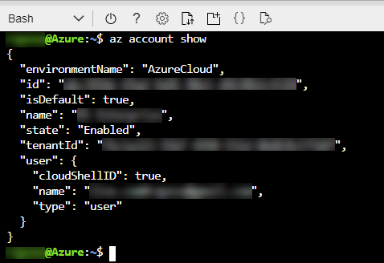
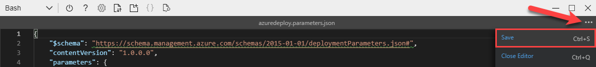
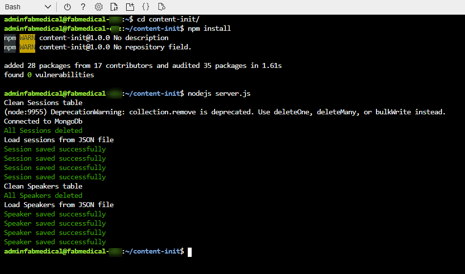
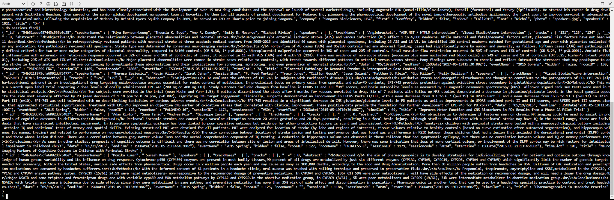
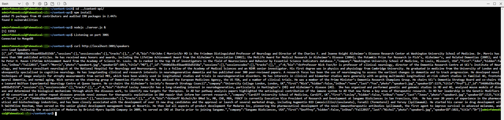
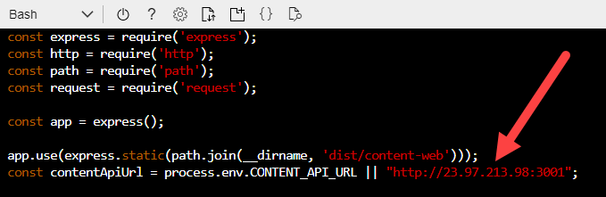
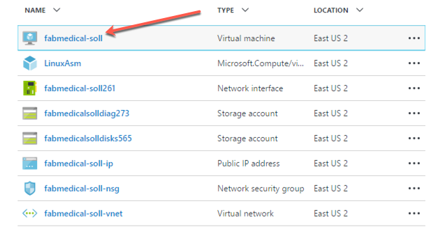
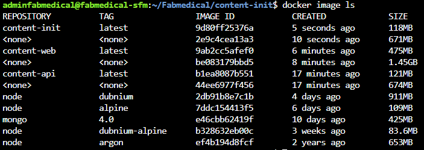
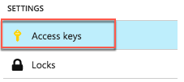

<div class="MCWHeader1">
Cloud-native applications
</div>

<div class="MCWHeader2">
Before the hands-on lab setup guide
</div>

<div class="MCWHeader3">
May 2021
</div>

Information in this document, including URL and other Internet Web site references, is subject to change without notice. Unless otherwise noted, the example companies, organizations, products, domain names, e-mail addresses, logos, people, places, and events depicted herein are fictitious, and no association with any real company, organization, product, domain name, e-mail address, logo, person, place or event is intended or should be inferred. Complying with all applicable copyright laws is the responsibility of the user. Without limiting the rights under copyright, no part of this document may be reproduced, stored in or introduced into a retrieval system, or transmitted in any form or by any means (electronic, mechanical, photocopying, recording, or otherwise), or for any purpose, without the express written permission of Microsoft Corporation.

Microsoft may have patents, patent applications, trademarks, copyrights, or other intellectual property rights covering subject matter in this document. Except as expressly provided in any written license agreement from Microsoft, the furnishing of this document does not give you any license to these patents, trademarks, copyrights, or other intellectual property.

The names of manufacturers, products, or URLs are provided for informational purposes only and Microsoft makes no representations and warranties, either expressed, implied, or statutory, regarding these manufacturers or the use of the products with any Microsoft technologies. The inclusion of a manufacturer or product does not imply endorsement of Microsoft of the manufacturer or product. Links may be provided to third party sites. Such sites are not under the control of Microsoft and Microsoft is not responsible for the contents of any linked site or any link contained in a linked site, or any changes or updates to such sites. Microsoft is not responsible for webcasting or any other form of transmission received from any linked site. Microsoft is providing these links to you only as a convenience, and the inclusion of any link does not imply endorsement of Microsoft of the site or the products contained therein.

© 2020 Microsoft Corporation. All rights reserved.

**Contents**

<!-- TOC -->

- [Cloud-native applications before the hands-on lab setup guide](#cloud-native-applications-before-the-hands-on-lab-setup-guide)
  - [Overview](#overview)
  - [Requirements](#requirements)
  - [Before the hands-on lab](#before-the-hands-on-lab)
    - [Task 1: Setup Azure Cloud Shell](#task-1-setup-azure-cloud-shell)
    - [Task 2: Download Starter Files](#task-2-download-starter-files)
    - [Task 3: Resource Group](#task-3-resource-group)
    - [Task 4: Create an SSH key](#task-4-create-an-ssh-key)
    - [Task 5: Deploy ARM Template](#task-5-deploy-arm-template)
    - [Task 6: Create a GitHub repository](#task-6-create-a-github-repository)
    - [Task 7: Connect securely to the build agent](#task-7-connect-securely-to-the-build-agent)
    - [Task 8: Complete the build agent setup](#task-8-complete-the-build-agent-setup)
    - [Task 9: Clone Repositories to the Build Agent](#task-9-clone-repositories-to-the-build-agent)
    - [Task 10: Test the Starter Application](#task-10-test-the-starter-application)
    - [Task 11: Build the Docker Images](#task-11-build-the-docker-images)
    - [Task 12: Run Docker Containers](#task-12-run-docker-containers)
    - [Task 13: Setup Environment Variables](#task-13-setup-environment-variables)
    - [Task 14: Push Images to Azure Container Registry](#task-14-push-images-to-azure-container-registry)
    - [Task 15: Setup CI Pipeline to Push Images](#task-15-setup-ci-pipeline-to-push-images)


<!-- /TOC -->

# Cloud-native applications before the hands-on lab setup guide

## Overview

Before the hands-on lab, you will need to prepare the environment by deploying the database and the application locally on a virtual machine using Docker and MongoDB. You'll also need to fork the GitHub repository containing the lab to your own GitHub account to be able to setup the CI/CD pipeline.

## Requirements

1. Microsoft Azure subscription must be pay-as-you-go or MSDN.

   - Trial subscriptions will _not_ work.

   - To complete this lab setup, ensure your account includes the following:

     - Has the [Owner](https://docs.microsoft.com/azure/role-based-access-control/built-in-roles#owner) built-in role for the subscription you use.

     - Is a [Member](https://docs.microsoft.com/azure/active-directory/fundamentals/users-default-permissions#member-and-guest-users) user in the Azure AD tenant you use. (Guest users will not have the necessary permissions.)

   - You must have enough cores available in your subscription to create the build agent and Azure Kubernetes Service cluster in [Task 5: Deploy ARM Template](#Task-5-Deploy-ARM-Template). You'll need eight cores if following the exact instructions in the lab, more if you choose additional agents or larger VM sizes. Execute the steps required before the lab to see if you need to request more cores in your sub.

2. An account in Microsoft [GitHub](https://github.com).

3. Local machine or a virtual machine configured with:

   - A browser, preferably Chrome for consistency with the lab implementation tests.

4. You will be asked to install other tools throughout the exercises.

## Before the hands-on lab

**Duration**: 60 minutes

You should follow all of the steps provided in this section _before_ taking part in the hands-on lab ahead of time as some of these steps take time.

### Task 1: Setup Azure Cloud Shell

1. Open a cloud shell by selecting the cloud shell icon in the menu bar.

   

2. The cloud shell opens in the browser window. Choose **Bash** if prompted or use the left-hand dropdown on the shell menu bar to choose **Bash** from the dropdown (as shown). If prompted, select **Confirm**.

   

3. You should make sure to set your default subscription correctly. To view your current subscription type:

   ```bash
   az account show
   ```

   

4. To set your default subscription to something other than the current selection, type the following, replacing {id} with the desired subscription id value:

   ```bash
   az account set --subscription {id}
   ```

> **Note**: To list all of your subscriptions, type:

   ```bash
   az account list
   ```

   

### Task 2: Download Starter Files

In this task, you use `git` to copy the lab content to your cloud shell so that the lab starter files will be available.

> **Note**: If you don't have a cloud shell available, refer back to [Task 1: Setup Azure Cloud Shell](#task-1-setup-azure-cloud-shell).

1. Type the following command and press `<ENTER>`:

   ```bash
   git clone https://github.com/microsoft/MCW-Cloud-native-applications.git
   ```

   > **Note**: If you do not have enough free space, you may need to remove extra files from your cloud shell environment.  Try running `azcopy jobs clean` to remove any `azcopy` jobs and data you do not need.

2. The lab files download.

   

3. We do not need the `.git` folder, and later steps will be less complex if we remove it. Run this command:

   ```bash
   rm -rf MCW-Cloud-native-applications/.git
   ```

### Task 3: Resource Group

Create an Azure Resource Group to hold most of the resources that you create in this hands-on lab. This approach makes it easier to clean up later.

1. In your cloud shell window, you type a command similar to the following command, be sure to replace the tokens:

   > **Note**: If you don't have a cloud shell available, refer back to [Task 1: Setup Azure Cloud Shell](#task-1-setup-azure-cloud-shell).

   ```bash
   az group create -l '[LOCATION]' -n 'fabmedical-[SUFFIX]'
   ```

   - **Suffix:** Throughout the lab, suffix should be used to make resources unique, like your email prefix or your first initial and last name.

   - **Location:** Choose a region where all Azure Container Registry SKUs have to be available, which is currently: Canada Central, Canada East, North Central US, Central US, South Central US, East US, East US 2, West US, West US 2, West Central US, France Central, UK South, UK West, North Europe, West Europe, Australia East, Australia Southeast, Brazil South, Central India, South India, Japan East, Japan West, Korea Central, Southeast Asia, East Asia, and remember this for future steps so that the resources you create in Azure are all kept within the same region.

   Example:

   ```bash
   az group create -l 'west us' -n 'fabmedical-sol'
   ```

2. When this completes, the Azure Portal shows your Resource Group.

   

### Task 4: Create an SSH key

You create VMs during the upcoming exercises. In this section, you create an SSH key to access the VMs securely.

1. From the cloud shell command line, enter the following command to ensure that a directory for the SSH keys exists. You can ignore any errors you see in the output.

   > **Note**: If you don't have a cloud shell available, refer back to [Task 1: Setup Azure Cloud Shell](#task-1-setup-azure-cloud-shell).

   ```bash
   mkdir .ssh
   ```

2. From the cloud shell command line, enter the following command to generate an SSH key pair. You can replace `admin` with your preferred name or handle.

   ```bash
   ssh-keygen -t RSA -b 2048 -C admin@fabmedical
   ```

3. When asked to save the generated key to a file, enter `.ssh/fabmedical` for the name.

4. Enter a passphrase when prompted, and **don't forget it**!

5. Because you entered `.ssh/fabmedical` the ssh-keygen generates the file in the `.ssh` folder in your user folder, where the cloud shell opens by default.

   

6. From the cloud shell command line, enter the following command to output the public key content. Copy this information to use later.

    ```bash
    cat .ssh/fabmedical.pub
    ```

7. Keep this cloud shell open and remain in the default directory. You will use this shell in later tasks.

    

### Task 5: Deploy ARM Template

In this section, you configure and execute an ARM template that creates all the resources that you need throughout the exercises.

1. In Azure cloud shell, switch to the ARM template directory:

   > **Note**: If you don't have a cloud shell available, refer back to [Task 1: Setup Azure Cloud Shell](#task-1-setup-azure-cloud-shell).

   ```bash
   cd MCW-Cloud-native-applications/Hands-on\ lab/arm/
   ```

2. Open the azuredeploy.parameters.json file for editing using Azure Cloud Shell editor.

   ```bash
   code azuredeploy.parameters.json
   ```

   

3. Update the values for the various keys so that they match your environment:

   - **Suffix**: Enter a shortened version of your SUFFIX with a max of 3 chars.
   - **VirtualMachineAdminUsernameLinux**: The Linux Build Agent VM admin username (example: `"adminfabmedical"`).
   - **VirtualMachineAdminPublicKeyLinux**: The Linux Build Agent VM admin ssh public key. You find this value in the `.ssh/fabmedical.pub` file created previously (example: `"ssh-rsa AAAAB3N(...)vPiybQV admin@fabmedical"`).
   - **CosmosLocation**: The primary location of the Azure Cosmos DB. Use the same location as the resource group previously created (example: `"eastus"`).
   - **CosmosLocationName**: The name of the primary location of the Azure Cosmos DB. Use the name of the same location as the resource group previously created (example: `"East US"`).
   - **CosmosPairedLocation**: The secondary location of the Azure Cosmos DB. The below link can be used to help find the Azure Region Pair for your primary location. (example: `"westus"`).
   - **CosmosPairedLocationName**: The name of the secondary location of the Azure Cosmos DB. Use the location name that matches the secondary location defined in the previous key (example: `"West US"`).

   > **Note**: A list of Azure Region Pairs can be found here: <https://docs.microsoft.com/en-us/azure/best-practices-availability-paired-regions#azure-regional-pairs>.

4. Select the **...** button and select **Save**.

   

5. Select the **...** button again and select **Close Editor**.

   

6. Create the needed resources by typing the following instruction (case sensitive), replacing {resourceGroup} with the name of the previously created resource group:

   ```bash
   az deployment group create --resource-group {resourceGroup} --template-file azuredeploy.json --parameters azuredeploy.parameters.json
   ```

   This command takes 30 to 60 minutes to deploy all lab resources. You can continue to the next task to setup GitHub while the deployment runs.

   > **Note**: If you get an error about the Cosmos DB name, ensure that you typed the `ComsosLocation` and `CosmosPairedLocation` without any spaces. Re-run the above command after you have corrected the name.

### Task 6: Create a GitHub repository

FabMedical has provided starter files for you. They have taken a copy of the websites for their customer Contoso Neuro and refactored it from a single node.js site into a website with a content API that serves up the speakers and sessions. This refactored code is a starting point to validate the containerization of their websites. Use this to help them complete a POC that validates the development workflow for running the website and API as Docker containers and managing them within the Azure Kubernetes Service environment.

1. Open a web browser and navigate to <https://www.github.com>. Log in using your GitHub account credentials.

2. In the upper-right corner, expand the user drop down menu and select **Your repositories**.

    

3. Next to the search criteria, locate and select the **New** button.

    

4. On the **Create a new repository** screen, name the repository **Fabmedical** and select the **Create repository** button.

    

5. On the **Quick setup** screen, copy the **HTTPS** GitHub URL for your new repository, paste this in notepad for future use.

    

6. Open a **new** Azure Cloud Shell console.  You can do this by selecting the **Open new session** button from the first console, or navigating to <https://shell.azure.com> and logging in with the same lab credentials.

7. Navigate to the FabMedical source code folder and list the contents.

   ```bash
   cd ~/MCW-Cloud-native-applications/Hands-on\ lab/lab-files/developer/
   ls
   ```

8. You'll see the listing includes three folders, one for the web site, another for the content API and one to initialize API data:

   ```bash
   content-api/
   content-init/
   content-web/
   ```

9. Set your username and email, which git uses for commits.

    ```bash
    git config --global user.email "you@example.com"
    git config --global user.name "Your Name"
    ```

10. Using the Cloud Shell, initialize a new git repository:

    ```bash
    git init
    git add .
    git commit -m "Initial Commit"
    ```

11. Set the remote origin to the GitHub URL by issuing the following command:

    ```bash
    git remote add origin <your GitHub URL>
    ```

12. Configure git CLI to cache your credentials, so that you don't have to keep re-typing them.

    ```bash
    git config --global --unset credential.helper
    git config --global credential.helper store
    ```

13. Push to the main branch by issuing the following command:

    ```bash
    git branch -m master main
    git push -u origin main
    ```

    > **Note**: If you have multi-factor authentication, you will need to create a personal access token when using the cloud shell. Reference the following link for help with setting up a GitHub personal access token to use for authenticating `git` with your GitHub account: <https://docs.github.com/en/github/authenticating-to-github/creating-a-personal-access-token>.

    > **Note**: Once you have your personal access token, retry the above command, use your token as the password.

14. Refresh your GitHub repository, you should now see the code published.

### Task 7: Connect securely to the build agent

In this section, you validate that you can connect to the new build agent
VM.

1. Open a **new** Azure Cloud Shell console and run the following command to find the IP address for the build agent VM provisioned when you ran the ARM deployment:

   > **Note**: If you don't have a cloud shell available, refer back to [Task 1: Setup Azure Cloud Shell](#task-1-setup-azure-cloud-shell).

   ```bash
   az vm show -d -g fabmedical-[SUFFIX] -n fabmedical-[SHORT_SUFFIX] --query publicIps -o tsv
   ```

   Example:

   ```bash
   az vm show -d -g fabmedical-sol -n fabmedical-SOL --query publicIps -o tsv
   ```

2. In the cloud shell output, take note of the public IP address for the VM.

   

3. Connect to the new VM you created by typing the following command:

   ```bash
    ssh -i [PRIVATEKEYNAME] [BUILDAGENTUSERNAME]@[BUILDAGENTIP]
   ```

   Replace the bracketed values in the command as follows:

   - `[PRIVATEKEYNAME]`: Use the private key name `.ssh/fabmedical`, created above.

   - `[BUILDAGENTUSERNAME]`: Use the username for the VM, in the default setup it is `adminfabmedical`.

   - `[BUILDAGENTIP]`: The IP address for the build agent VM, retrieved in the previous step.

   ```bash
   ssh -i .ssh/fabmedical adminfabmedical@52.174.141.11
   ```

4. When asked to confirm if you want to connect, as the authenticity of the connection cannot be validated, type `yes`.

5. When asked for the passphrase for the private key you created previously, enter this value.

6. SSH connects to the VM and displays a command prompt such as the following. Keep this cloud shell window open for the next step:

   `adminfabmedical@fabmedical-SUFFIX:~$`

   

> **Note**: If you have issues connecting, you may have pasted the SSH public key incorrectly in the ARM template. Unfortunately, if this is the case, you will have to recreate the VM and try again.

### Task 8: Complete the build agent setup

In this task, you update the packages and install the Docker engine.

1. Go to the cloud shell window that has the SSH connection open to the build agent VM.

2. Update the Ubuntu packages and install curl and support for repositories over HTTPS in a single step by typing the following in a single line command. Respond by typing `Y` and pressing enter, if asked if you would like to proceed.

   ```bash
   sudo apt-get update && sudo apt install apt-transport-https ca-certificates curl software-properties-common
   ```

   > **Note**: This is a single line.

3. Add Docker's official GPG key by typing the following in a single line command:

   ```bash
   curl -fsSL https://download.docker.com/linux/ubuntu/gpg | sudo apt-key add -
   ```

4. Add Docker's stable repository to Ubuntu packages list by typing the following in a single line command:

   ```bash
   sudo add-apt-repository "deb [arch=amd64] https://download.docker.com/linux/ubuntu $(lsb_release -cs) stable"
   ```

5. Add NodeJs PPA to use NodeJS LTS release and update the Ubuntu packages and install Docker engine, node.js, and the node package manager by typing the following commands, each on their own line. If asked if you would like to proceed, respond by typing `Y` and pressing enter.

   ```bash
   sudo apt-get install curl python-software-properties -y

   curl -sL https://deb.nodesource.com/setup_12.x | sudo -E bash -

   sudo apt-get update && sudo apt-get install -y docker-ce nodejs mongodb-clients
   ```

6. Now, upgrade the Ubuntu packages to the latest version by typing the following in a single line command.

   ```bash
   sudo apt-get upgrade -y
   ```

7. When the command has completed, check the Docker version installed by executing this command. The output may look something like that shown in the following screenshot. Note that the server version is not shown yet, because you didn't run the command with elevated privileges (to be addressed shortly).

   ```bash
   docker version
   ```

   

8. You may check the versions of node.js and npm as well, just for information purposes, using these commands:

   ```bash
   nodejs --version

   npm -version
   ```

9. Install the Angular CLI.

    ```bash
    sudo npm install -g @angular/cli
    ```

10. To remove the requirement to use sudo, add your user to the Docker group. You can ignore any errors you see in the output.

    ```bash
    sudo usermod -aG docker $USER
    ```

    

11. For the user permission changes to take effect, exit the SSH
    session by typing `exit`, then press \<Enter\>. Reconnect to the build agent VM using SSH as you did in the previous task.

    ```bash
    ssh -i .ssh/fabmedical adminfabmedical@52.174.141.11
    ```

12. Repeat the `docker version` command, and note the output now shows the server version as well.

    

13. Run a few Docker commands:

    - One to see if there are any containers presently running.

      ```bash
      docker container ls
      ```

    - One to see if any containers exist, whether running or not.

      ```bash
      docker container ls -a
      ```

14. In both cases, you have an empty list but no errors while running the command. Your build agent is ready with the Docker engine running correctly.

    

### Task 9: Clone Repositories to the Build Agent

In this task, you clone your repositories from GitHub so you can work with them on the build agent.

1. As you previously did in cloud shell, set your username and email which are used for git commits.

   ```bash
   git config --global user.email "you@example.com"
   git config --global user.name "Your Name"
   ```

   > **Note**: In some cases, the `root` user owns your user's `.config` folder. If this happens, run the following command to return ownership to `adminfabmedical` and then try the `git` command again:
   >
   > ```bash
   > sudo chown -R $USER:$(id -gn $USER) /home/adminfabmedical/.config
   > ```

2. Configure git CLI to cache your credentials, so that you don't have to keep
   re-typing them.

   ```bash
   git config --global credential.helper cache
   ```

   > **Note**: In some cases, the `root` user owns your user's `.config` folder. If this happens, run the following command to return ownership to `adminfabmedical` and then try the `git` command again:
   >
   > ```bash
   > sudo chown -R $USER:$(id -gn $USER) /home/adminfabmedical/.config
   > ```

3. Use the GitHub URL to clone the repository code to your build agent machine.

   ```bash
   git clone <GITHUB_REPOSITORY_URL>
   ```

   > **Note**: In some cases, the `root` user owns your user's `.config` folder. If this happens, run the following command to return ownership to `adminfabmedical` and then try the `git` command again:
   >
   > ```bash
   > sudo chown -R $USER:$(id -gn $USER) /home/adminfabmedical/.config
   > ```

### Task 10: Test the Starter Application

In this task, you will take the starter files and run the node.js application as a Docker application.  You will build the Docker images from the existing files and run containers to test and execute the application.

1. From Azure Cloud Shell, connect to your build agent if you are not already connected.

2. Type the following command to create a Docker network named `fabmedical`:

   ```bash
   docker network create fabmedical
   ```

3. Run an instance of mongodb to use for local testing.

   ```bash
   docker container run --name mongo --net fabmedical -p 27017:27017 -d mongo:4.0
   ```

   > **Note**:  With the existing source code written for MongoDB, it can be pointed towards the Azure Cosmos DB MongoDB API endpoint. The Azure Cosmos DB Emulator could be used for local development on Windows; however, the Cosmos DB emulator does not support Linux. As a result, when using Linux for development, MongoDB is still needed for local development environments; with Azure Cosmos DB used for data storage in the cloud. This allows existing source code written for MongoDB storage to be easily migrated to using Azure Cosmos DB backend.

4. Confirm that the mongo container is running and ready.

   ```bash
   docker container list
   docker container logs mongo
   ```

   

5. Connect to the mongo instance using the mongo shell and test some basic commands:

   ```bash
   mongo
   ```

   ```text
   show dbs
   quit()
   ```

   

6. To initialize the local database with test content, first navigate to the content-init directory and run npm install.

   ```bash
   cd ~/Fabmedical/content-init
   npm install
   ```

   > **Note**: In some cases, the `root` user will be assigned ownership of your user's `.config` folder. If this happens, run the following command to return ownership to `adminfabmedical` and then try `npm install` again:

   ```bash
   sudo chown -R $USER:$(id -gn $USER) /home/adminfabmedical/.config
   ```

7. Initialize the database.

   ```bash
   nodejs server.js
   ```

   

8. Confirm that the database now contains test data.

   ```bash
   mongo
   ```

   ```text
   show dbs
   use contentdb
   show collections
   db.speakers.find()
   db.sessions.find()
   quit()
   ```

   This should produce output similar to the following:

   

9. Now navigate to the `content-api` directory and run npm install.

   ```bash
   cd ../content-api
   npm install
   ```

   > **Note**: In some cases, the `root` user will be assigned ownership of your user's `.config` folder. If this happens, run the following command to return ownership to `adminfabmedical` and then try `npm install` again:

   ```bash
   sudo chown -R $USER:$(id -gn $USER) /home/adminfabmedical/.config
   ```

10. Start the API as a background process.

    ```bash
    nodejs ./server.js &
    ```

    

11. Press `ENTER` again to get to a command prompt for the next step.

12. Test the API using curl. You will request the speaker's content, and this will return a JSON result.

    ```bash
    curl http://localhost:3001/speakers
    ```

    

13. Navigate to the web application directory, run `npm install` and `ng build`.

    ```bash
    cd ../content-web
    npm install
    ng build
    ```

    

    > **Note**: In some cases, the `root` user will be assigned ownership of your user's `.config` folder. If this happens, run the following command to return ownership to `adminfabmedical` and then try `npm install` again:

    ```bash
    sudo chown -R $USER:$(id -gn $USER) /home/adminfabmedical/.config
    ```

14. From Azure cloud shell, run the following command to find the IP address for the build agent VM provisioned when you ran the ARM deployment.

    ```bash
    az vm show -d -g fabmedical-[SUFFIX] -n fabmedical-[SHORT_SUFFIX] --query publicIps -o tsv
    ```

    Example:

    ```bash
    az vm show -d -g fabmedical-sol -n fabmedical-SOL --query publicIps -o tsv
    ```

15. From the cloud shell in the build machine edit the `app.js` file using vim.

    ```bash
    vim app.js
    ```

    Then press **_i_** to get into the edit mode, after that replace localhost with the build machine IP address.

    

    Then press **_ESC_**, write **_:wq_** to save you changes and close the file.

16. Now run the content-web application in the background.

    ```bash
    node ./app.js &
    ```

    Press `ENTER` again to get a command prompt for the next step.

17. Test the web application using curl. You will see HTML output returned without errors.

    ```bash
    curl http://localhost:3000
    ```

18. Leave the application running for the next task.

19. If you received a JSON response to the /speakers content request and an HTML response from the web application, your environment is working as expected.

20. From the Azure portal select the resource group you created named `fabmedical-SUFFIX`.

21. Select the build agent VM named `fabmedical-SUFFIX` from your list of available resources.

   

22. From the **Virtual Machine** blade overview, find the **IP address** of the VM.

   

23. Test the web application from a browser. Navigate to the web application using your build agent IP address at port `3000`.

   ```text
   http://[BUILDAGENTIP]:3000

   EXAMPLE: http://13.68.113.176:3000
   ```

24. Select the Speakers and Sessions links in the header. You will see the pages display the HTML version of the JSON content you curled previously.

25. Once you have verified the application is accessible through a browser, go to your cloud shell window and stop the running node processes.

   ```bash
   killall nodejs
   killall node
   ```

### Task 11: Build the Docker Images

In this task, you will build the Docker images for the application --- one for the API application and another for the web application. Each image will be created via Docker commands that rely on a Dockerfile.

1. From cloud shell connected to the build agent VM, type the following command to view any Docker images on the VM. The list will only contain the mongodb image downloaded earlier.

   ```bash
   docker image ls
   ```

2. From the content-api (`cd ~/Fabmedical/content-api`) folder containing the API application files and a Dockerfile, type the following command to create a Docker image for the API application. This command does the following:

   - Executes the Docker build command to produce the image

   - Tags the resulting image with the name `content-api` (-t)

   - The final dot (`.`) indicates to use the Dockerfile in this current directory context. By default, this file is expected to have the name `Dockerfile` (case sensitive).

   ```bash
   docker image build -t content-api .
   ```

3. Once the image is successfully built, run the Docker images listing command again. You will see several new images: the node images and your container image.

   ```bash
   docker image ls
   ```

   Notice the untagged image. This is the build stage which contains all the intermediate files not needed in your final image.

   

4. Navigate to the content-web folder again and list the files. Note that this folder also has a Dockerfile.

   ```bash
   cd ../content-web
   ll
   ```

5. View the Dockerfile contents. Type the following command:

   ```bash
   cat Dockerfile
   ```

   > Notice that the `content-web` Dockerfile build stage includes additional tools for a front-end Angular application in addition to installing npm packages.

6. Type the following command to create a Docker image for the web application.

   ```bash
   docker image build -t content-web .
   ```

7. Navigate to the content-init folder again and list the files. Note that this folder already has a Dockerfile.

   ```bash
   cd ../content-init
   ll
   ```

8. View the Dockerfile contents. Type the following command:

   ```bash
   cat Dockerfile
   ```

9.  Type the following command to create a Docker image for the init application.

      ```bash
      docker image build -t content-init .
      ```

10. When complete, you will see eight images now exist when you run the Docker images command.

   ```bash
   docker image ls
   ```

   

### Task 12: Run Docker Containers

The web application container will be calling endpoints exposed by the API application container and the API application container will be communicating with mongodb. In this exercise, you will launch the images you created as containers on the same bridge network you created when starting mongodb.

1. Create and start the API application container with the following command. The command does the following:

   - Names the container `api` for later reference with Docker commands.

   - Instructs the Docker engine to use the `fabmedical` network.

   - Instructs the Docker engine to use port `3001` and map that to the internal container port `3001`.

   - Creates a container from the specified image, by its tag, such as `content-api`.

   ```bash
   docker container run --name api --net fabmedical -p 3001:3001 content-api
   ```

2. The `docker container run` command has failed because it is configured to connect to mongodb using a localhost URL. However, now that content-api is isolated in a separate container, it cannot access mongodb via localhost even when running on the same docker host. Instead, the API must use the bridge network to connect to mongodb.

   ```text
   > content-api@0.0.0 start
   > node ./server.js

   Listening on port 3001
   Could not connect to MongoDB!
   MongooseServerSelectionError: connect ECONNREFUSED 127.0.0.1:27017
   npm notice
   npm notice New patch version of npm available! 7.0.8 -> 7.0.13
   npm notice Changelog: <https://github.com/npm/cli/releases/tag/v7.0.13>
   npm notice Run `npm install -g npm@7.0.13` to update!
   npm notice
   npm ERR! code 255
   npm ERR! path /usr/src/app
   npm ERR! command failed
   npm ERR! command sh -c node ./server.js

   npm ERR! A complete log of this run can be found in:
   npm ERR!     /root/.npm/_logs/2020-11-23T03_04_12_948Z-debug.log
   ```

3. The content-api application allows an environment variable to configure the mongodb connection string. Remove the existing container, and then instruct the docker engine to set the environment variable by adding the `-e` switch to the `docker container run` command. Also, use the `-d` switch to run the api as a daemon.

   ```bash
   docker container rm api
   docker container run --name api --net fabmedical -p 3001:3001 -e MONGODB_CONNECTION=mongodb://mongo:27017/contentdb -d content-api
   ```

4. Enter the command to show running containers. You will observe that the `api` container is in the list. Use the docker logs command to see that the API application has connected to mongodb.

   ```bash
   docker container ls
   docker container logs api
   ```

   

5. Test the API by curling the URL. You will see JSON output as you did when testing previously.

   ```bash
   curl http://localhost:3001/speakers
   ```

6. Create and start the web application container with a similar `docker container run` command -- instruct the docker engine to use any port with the `-P` command.

   ```bash
   docker container run --name web --net fabmedical -P -d content-web
   ```

7. Enter the command to show running containers again, and you will observe that both the API and web containers are in the list. The web container shows a dynamically assigned port mapping to its internal container port `3000`.

   ```bash
   docker container ls
   ```

   

8. Test the web application by fetching the URL with curl. For the port, use the dynamically assigned port, which you can find in the output from the previous command. You will see HTML output, as you did when testing previously.

   ```bash
   curl http://localhost:[PORT]/speakers.html
   ```

### Task 13: Setup Environment Variables

In this task, you will configure the `web` container to communicate with the API container using an environment variable, similar to the way the mongodb connection string is provided to the api.

1. From cloud shell connected to the build agent VM, stop and remove the web container using the following commands.

   ```bash
   docker container stop web
   docker container rm web
   ```

2. Validate that the web container is no longer running or present by using the `-a` flag as shown in this command. You will see that the `web` container is no longer listed.

   ```bash
   docker container ls -a
   ```

3. Review the `app.js` file.

   ```bash
   cd ../content-web
   cat app.js
   ```

4. Observe that the `contentApiUrl` variable can be set with an environment variable.

   ```javascript
   const contentApiUrl = process.env.CONTENT_API_URL || "http://[VM IP]:3001";
   ```

5. Open the Dockerfile for editing using Vim and press the `i` key to go into edit mode.

   ```bash
   vi Dockerfile
   <i>
   ```

6. Locate the `EXPOSE` line shown below and add a line above it that sets the default value for the environment variable, as shown in the screenshot.

   ```Dockerfile
   ENV CONTENT_API_URL http://localhost:3001
   ```

   

7. Press the Escape key and type `:wq` and then press the Enter key to save and close the file.

   ```text
   <Esc>
   :wq
   <Enter>
   ```

8. Rebuild the web application Docker image using the same command as you did previously.

   ```bash
   docker image build -t content-web .
   ```

9. Create and start the image passing the correct URI to the API container as an environment variable. This variable will address the API application using its container name over the Docker network you created. After running the container, check to see the container is running and note the dynamic port assignment for the next step.

   ```bash
   docker container run --name web --net fabmedical -P -d -e CONTENT_API_URL=http://api:3001 content-web
   docker container ls
   ```

10. Curl the speakers path again, using the port assigned to the web container. Again, you will see HTML returned, but because curl does not process javascript, you cannot determine if the web application is communicating with the api application. You must verify this connection in a browser.

    ```bash
    curl http://localhost:[PORT]/speakers.html
    ```

11. You will not be able to browse to the web application on the ephemeral port because the VM only exposes a limited port range. Now you will stop the web container and restart it using port `3000` to test in the browser. Type the following commands to stop the container, remove it, and run it again using explicit settings for the port.

    ```bash
    docker container stop web
    docker container rm web
    docker container run --name web --net fabmedical -p 3000:3000 -d -e CONTENT_API_URL=http://api:3001 content-web
    ```

    > **WARNING:** If you receive an error such as `Error starting userland proxy: listen tcp4 0.0.0.0:3000: bind: address already in use.` the previous Node instance might be holding the port 3000. Run `sudo pkill node` to kill the local node instance.

12. Curl the speaker path again, using port `3000`. You will see the same HTML returned.

    ```bash
    curl http://localhost:3000/speakers.html
    ```

13. You can now use a web browser to navigate to the website and successfully view the application at port `3000`. Replace `[BUILDAGENTIP]` with the **IP address** you used previously.

    ```bash
    http://[BUILDAGENTIP]:3000

    EXAMPLE: http://13.68.113.176:3000
    ```

14. Commit your changes and push to the repository.

    ```bash
    cd ~/Fabmedical
    git add .
    git commit -m "Setup Environment Variables"
    git push
    ```

    Enter credentials if prompted.

### Task 14: Push Images to Azure Container Registry

To run containers in a remote environment, you will typically push images to a Docker registry, where you can store and distribute images. Each service will have a repository that can be pushed to and pulled from with Docker commands. Azure Container Registry (ACR) is a managed private Docker registry service based on Docker Registry v2.

In this task, you will push images to your ACR account, version images with tagging, and setup continuous integration (CI) to build future versions of your containers and push them to ACR automatically.

1. In the [Azure Portal](https://portal.azure.com/), navigate to the ACR you created in Before the hands-on lab.

2. Select **Access keys** under **Settings** on the left-hand menu.

   

3. The Access keys blade displays the Login server, username, and password that will be required for the next step. Keep this handy as you perform actions on the build VM.

   > **Note**: If the username and password do not appear, select Enable on the Admin user option.

4. From the cloud shell session connected to your build VM, login to your ACR account by typing the following command. Follow the instructions to complete the login.

   ```bash
   docker login [LOGINSERVER] -u [USERNAME] -p [PASSWORD]
   ```

   For example:

   ```bash
   docker login fabmedicalsoll.azurecr.io -u fabmedicalsoll -p +W/j=l+Fcze=n07SchxvGSlvsLRh/7ga
   ```

   

   > **Tip**: Make sure to specify the fully qualified registry login server (all lowercase).

5. Run the following commands to properly tag your images to match your ACR account name.

   ```bash
   docker image tag content-web [LOGINSERVER]/content-web
   docker image tag content-api [LOGINSERVER]/content-api
   ```

   > **Note**: Be sure to replace the `[LOGINSERVER]` of your ACR instance.

6. List your docker images and look at the repository and tag. Note that the repository is prefixed with your ACR login server name, such as the sample shown in the screenshot below.

   ```bash
   docker image ls
   ```

   

7. Push the images to your ACR account with the following command:

   ```bash
   docker image push [LOGINSERVER]/content-web
   docker image push [LOGINSERVER]/content-api
   ```

   ![In this screenshot of the console window, an example of images being pushed to an ACR account results from typing and running the following at the command prompt: docker push [LOGINSERVER]/content-web.](media/image67.png "Push image to ACR")

8. In the Azure Portal, navigate to your ACR account, and select **Repositories** under **Services** on the left-hand menu. You will now see two containers **(2)**, one for each image.

   

9. Select `content-api` **(1)**. You will see the latest tag **(2)** is assigned.

   

10. From the cloud shell session attached to the VM, assign the `v1` tag to each image with the following commands. Then list the Docker images to note that there are now two entries for each image: showing the `latest` tag and the `v1` tag. Also note that the image ID is the same for the two entries, as there is only one copy of the image.

    ```bash
    docker image tag [LOGINSERVER]/content-web:latest [LOGINSERVER]/content-web:v1
    docker image tag [LOGINSERVER]/content-api:latest [LOGINSERVER]/content-api:v1
    docker image ls
    ```

    

11. Push the images to your ACR account with the following command:

    ```bash
    docker image push [LOGINSERVER]/content-web:v1
    docker image push [LOGINSERVER]/content-api:v1
    ```

12. Refresh one of the repositories to see the two versions of the image now appear.

    

13. Run the following commands to pull an image from the repository. Note that the default behavior is to pull images tagged with `latest`. You can pull a specific version using the version tag. Also, note that since the images already exist on the build agent, nothing is downloaded.

    ```bash
    docker image pull [LOGINSERVER]/content-web
    docker image pull [LOGINSERVER]/content-web:v1
    ```

### Task 15: Setup CI Pipeline to Push Images

In this task, you will use YAML to define a GitHub Actions workflow that builds your Docker
image and pushes it to your ACR instance automatically.

1. In GitHub, return to the **Fabmedical** repository screen, and select the **Settings** tab.

2. From the left menu, select **Secrets**.

3. Select the **New repository secret** button.

    

4. In the **New secret** form, enter the name `ACR_USERNAME` and for the value, paste in the Azure Container Registry **Username** that was copied previously. Select **Add secret**.

    

5. Add another Secret, by entering the name `ACR_PASSWORD` and for the value, paste in the Azure Container Registry **Password** that was copied previously.

    

6. In your Azure Cloud Shell, run `az ad sp create-for-rbac --sdk-auth` in to generate an Azure Active Directory service principal with credentials.  Copy the output JSON (example below) for the next step.

   ```json
   {
      "clientId": "<client id>",
      "clientSecret": "<client secret>",
      "subscriptionId": "<subscription id>",
      "tenantId": "<tenant id>",
      "activeDirectoryEndpointUrl": "https://login.microsoftonline.com",
      "resourceManagerEndpointUrl": "https://management.azure.com/",
      "activeDirectoryGraphResourceId": "https://graph.windows.net/",
      "sqlManagementEndpointUrl": "https://management.core.windows.net:8443/",
      "galleryEndpointUrl": "https://gallery.azure.com/",
      "managementEndpointUrl": "https://management.core.windows.net/"
   }
   ```

7. Add another Secret named `AZURE_CREDENTIALS` and use the JSON output from the previous step as the value.

8. In your Azure Cloud Shell session connected to the build agent VM, navigate to the `~/Fabmedical` directory:

   ```bash
   cd ~/Fabmedical
   ```

9. Before the GitHub Actions workflows can be setup, the `.github/workflows` directory needs to be created, if it doesn't already exist. Do this by running the following commands:

    ```bash
    mkdir ~/Fabmedical/.github
    mkdir ~/Fabmedical/.github/workflows
    ```

10. Navigate to the `.github/workflows` directory:

    ```bash
    cd ~/Fabmedical/.github/workflows
    ```

11. Next create the workflow YAML file.

    ```dotnetcli
    vi content-web.yml
    ```

   Add the following as the content. Be sure to replace the following placeholders:

   - replace `[SHORT_SUFFIX]` with your short suffix such as `SOL`.

   ```yml
   name: content-web

   # This workflow is triggered on push to the 'content-web' directory of the  main branch of the repository
   on:
      push:
         branches:
            - main
         paths:
            - 'content-web/**'

      # Configure workflow to also support triggering manually
      workflow_dispatch:

   # Environment variables are defined so that they can be used throughout the job definitions.
   env:
     imageRepository: 'content-web'
     resourceGroupName: 'fabmedical-[SHORT_SUFFIX]'
     clusterName: 'fabmedical-[SHORT_SUFFIX]'
     containerRegistryName: 'fabmedical[SHORT_SUFFIX]'
     containerRegistry: 'fabmedical[SHORT_SUFFIX].azurecr.io'
     dockerfilePath: './content-web'
     tag: '${{ github.run_id  }}'

   # Jobs define the actions that take place when code is pushed to the main branch
   jobs:
     build-and-publish-docker-image:
       name: Build and Push Docker Image
       runs-on: ubuntu-latest
       steps:
       # Checkout the repo
       - uses: actions/checkout@master

       - name: Set up Docker Buildx
         uses: docker/setup-buildx-action@v1

       - name: Login to ACR
         uses: docker/login-action@v1
         with:
           registry: ${{ env.containerRegistry }}
           username: ${{ secrets.ACR_USERNAME }}
           password: ${{ secrets.ACR_PASSWORD }}

       - name: Build and push an image to container registry
         uses: docker/build-push-action@v2
         with:
           context: ${{ env.dockerfilePath  }}
           file: "${{ env.dockerfilePath }}/Dockerfile"
           pull: true
           push: true
           tags: |
             ${{ env.containerRegistry }}/${{ env.imageRepository }}:${{ env.tag }}
             ${{ env.containerRegistry }}/${{ env.imageRepository }}:latest
       
       - name: Set Kubernetes Context
         uses: azure/aks-set-context@v1
         with:
           creds: '${{ secrets.AZURE_CREDENTIALS }}' # Azure credentials
           resource-group: '${{ env.resourceGroupName }}'
           cluster-name: '${{ env.clusterName }}'

       - name: Create ingress-demo namespace
         run: |
           kubectl create namespace ingress-demo --dry-run -o json | kubectl apply -f -

       - name: Create ACR credentials secret
         uses: azure/k8s-create-secret@v1
         with:
           container-registry-url: ${{ env.containerRegistry }}.azurecr.io
           container-registry-username: ${{ secrets.ACR_USERNAME }}
           container-registry-password: ${{ secrets.ACR_PASSWORD }}
           secret-name: ingress-demo-secret
           namespace: ingress-demo
           arguments: --force true

   # This task will be important in Task 3 of Exercise 4
   #   - name: Deploy to AKS
   #     uses: azure/k8s-deploy@v1
   #     with:
   #       manifests: |
   #         api.deployment.yml
   #         web.deployment.yml
   #         web.service.yml
   #       images: |
   #         ${{ env.containerRegistry }}.azurecr.io/${{ env.imageRepository }}:${{ env.tag }}
   #       imagepullsecrets: |
   #         ingress-demo-secret
   #       namespace: ingress-demo
      
   ```

12. Save the file and exit VI by pressing `<Esc>` then `:wq`.

13. Save the pipeline YAML, then commit and push it to the Git repository:

    ```bash
    git add .
    git commit -m "Added workflow YAML"
    git push
    ```

14. In GitHub, return to the **Fabmedical** repository screen, and select the **Actions** tab.

15. On the **Actions** page, select the **content-web** workflow.

16. On the **content-web** workflow, select **Run workflow** and manually trigger the workflow to execute.

    

17. After a second, the newly triggered workflow execution will display in the list. Select the new **content-web** execution to view its status.

18. Selecting the **Build and Push Docker Image** job of the workflow will display its execution status.

    

19. Next, setup the `content-api` workflow. This repository already includes `content-api.yml` located within the `.github/workflows` directory. Open the `.github/workflows/content-api.yml` file for editing.

20. Edit the `resourceGroupName` and `containerRegistry` environment values to replace `[SHORT_SUFFIX]` with your own three-letter suffix so that it matches your container registry's name and resource group.

    

21. Commit and push the changes to the Git repository:

    ```bash
    git add .
    git commit -m "Updated workflow YAML"
    git push
    ```

22. Save the file, then navigate to the repositories in GitHub, select Actions, and then manually run the **content-api** workflow.

You should follow all steps provided _before_ performing the Hands-on lab.

