<div class="MCWHeader1">
Cloud-native applications
</div>

<div class="MCWHeader2">
Hands-on lab step-by-step
</div>

<div class="MCWHeader3">
May 2021
</div>

Information in this document, including URL and other Internet Web site references, is subject to change without notice. Unless otherwise noted, the example companies, organizations, products, domain names, e-mail addresses, logos, people, places, and events depicted herein are fictitious, and no association with any real company, organization, product, domain name, e-mail address, logo, person, place or event is intended or should be inferred. Complying with all applicable copyright laws is the responsibility of the user. Without limiting the rights under copyright, no part of this document may be reproduced, stored in or introduced into a retrieval system, or transmitted in any form or by any means (electronic, mechanical, photocopying, recording, or otherwise), or for any purpose, without the express written permission of Microsoft Corporation.

Microsoft may have patents, patent applications, trademarks, copyrights, or other intellectual property rights covering subject matter in this document. Except as expressly provided in any written license agreement from Microsoft, the furnishing of this document does not give you any license to these patents, trademarks, copyrights, or other intellectual property.

The names of manufacturers, products, or URLs are provided for informational purposes only and Microsoft makes no representations and warranties, either expressed, implied, or statutory, regarding these manufacturers or the use of the products with any Microsoft technologies. The inclusion of a manufacturer or product does not imply endorsement of Microsoft of the manufacturer or product. Links may be provided to third party sites. Such sites are not under the control of Microsoft and Microsoft is not responsible for the contents of any linked site or any link contained in a linked site, or any changes or updates to such sites. Microsoft is not responsible for webcasting or any other form of transmission received from any linked site. Microsoft is providing these links to you only as a convenience, and the inclusion of any link does not imply endorsement of Microsoft of the site or the products contained therein.

© 2020 Microsoft Corporation. All rights reserved.

Microsoft and the trademarks listed at https://www.microsoft.com/en-us/legal/intellectualproperty/Trademarks/Usage/General.aspx are trademarks of the Microsoft group of companies. All other trademarks are property of their respective owners.

**Contents**

<!-- TOC -->
- [Cloud-native applications - Hands-on lab step-by-step](#cloud-native-applications---hands-on-lab-step-by-step)
  - [Abstract and learning objectives](#abstract-and-learning-objectives)
  - [Prerequisites](#prerequisites)
  - [Overview](#overview)
  - [Solution architecture](#solution-architecture)
  - [Requirements](#requirements)
  - [Exercise 1: Migrate MongoDB to Cosmos DB using Azure Database Migration Service](#exercise-1-migrate-mongodb-to-cosmos-db-using-azure-database-migration-service)
    - [Task 1: Enable Microsoft.DataMigration resource provider](#task-1-enable-microsoftdatamigration-resource-provider)
    - [Task 2: Provision Azure Database Migration Service](#task-2-provision-azure-database-migration-service)
    - [Task 3: Migrate data to Azure Cosmos DB](#task-3-migrate-data-to-azure-cosmos-db)
  - [Exercise 2: Deploy the solution to Azure Kubernetes Service](#exercise-2-deploy-the-solution-to-azure-kubernetes-service)
    - [Task 1: Tunnel into the Azure Kubernetes Service cluster](#task-1-tunnel-into-the-azure-kubernetes-service-cluster)
    - [Task 2: Deploy a service using the Azure Portal](#task-2-deploy-a-service-using-the-azure-portal)
    - [Task 3: Deploy a service using kubectl](#task-3-deploy-a-service-using-kubectl)
    - [Task 4: Review Azure Monitor for Containers](#task-4-review-azure-monitor-for-containers)
  - [Exercise 3: Scale the application and test HA](#exercise-3-scale-the-application-and-test-ha)
    - [Task 1: Increase service instances from the Azure Portal](#task-1-increase-service-instances-from-the-azure-portal)
    - [Task 2: Resolve failed provisioning of replicas](#task-2-resolve-failed-provisioning-of-replicas)
    - [Task 3: Restart containers and test HA](#task-3-restart-containers-and-test-ha)
    - [Task 4: Configure Cosmos DB Autoscale](#task-4-configure-cosmos-db-autoscale)
    - [Task 5: Test Cosmos DB Autoscale](#task-5-test-cosmos-db-autoscale)
  - [Exercise 4: Working with services and routing application traffic](#exercise-4-working-with-services-and-routing-application-traffic)
    - [Task 1: Update an external service to support dynamic discovery with a load balancer](#task-1-update-an-external-service-to-support-dynamic-discovery-with-a-load-balancer)
    - [Task 2: Adjust CPU constraints to improve scale](#task-2-adjust-cpu-constraints-to-improve-scale)
    - [Task 3: Perform a rolling update](#task-3-perform-a-rolling-update)
    - [Task 4: Configure Kubernetes Ingress](#task-4-configure-kubernetes-ingress)
  - [After the hands-on lab](#after-the-hands-on-lab)

<!-- /TOC -->

# Cloud-native applications - Hands-on lab step-by-step

## Abstract and learning objectives

This hands-on lab is designed to guide you through the process of building and deploying Docker images to the Kubernetes platform hosted on Azure Kubernetes Services (AKS), in addition to learning how to work with dynamic service discovery, service scale-out, and high-availability.

At the end of this lab, you will be better able to build and deploy containerized applications to Azure Kubernetes Service and perform common DevOps procedures.

## Prerequisites

The lab assumes some basic knowledge of Docker containers and Kubernetes. The following modules on Microsoft Learn would be helpful:

| Description | URL |
|-|-|
| Introduction to Docker Containers | https://docs.microsoft.com/en-us/learn/modules/intro-to-docker-containers/       |
| Introduction to Containers | https://docs.microsoft.com/en-us/learn/modules/intro-to-containers/              |
| Build and Store Container Images| https://docs.microsoft.com/en-us/learn/modules/build-and-store-container-images/ |
| Introduction to Kubernetes | https://docs.microsoft.com/en-us/learn/modules/intro-to-kubernetes/              |
|||

The lab also requires the completion of the steps outlined in the [Before the HOL - Cloud-native applications](Before%20the%20HOL%20-%20Cloud-native%20applications.md) document in order to prepare an appropriate environment to execute the exercises in this lab. 

## Overview

Fabrikam Medical Conferences (FabMedical) provides conference website services tailored to the medical community. They are refactoring their application code, based on node.js, so that it can run as a Docker application, and want to implement a POC that will help them get familiar with the development process, lifecycle of deployment, and critical aspects of the hosting environment. They will be deploying their applications to Azure Kubernetes Service and want to learn how to deploy containers in a dynamically load-balanced manner, discover containers, and scale them on demand.

In this hands-on lab, you will assist with completing this POC with a subset of the application codebase. You will create a build agent based on Linux, and an Azure Kubernetes Service cluster for running deployed applications. You will be helping them to complete the Docker setup for their application, test locally, push to an image repository, deploy to the cluster, and test load-balancing and scale.

> **Important**: Most Azure resources require unique names. Throughout these steps, you will see the word "SUFFIX" as part of resource names. You should replace this with a unique handle (like your Microsoft Account email prefix) to ensure unique names for resources.

## Solution architecture

Below is a diagram of the solution architecture you will build in this lab. Please study this carefully, so you understand the whole of the solution as you are working on the various components.

The solution will use Azure Kubernetes Service (AKS), which means that the container cluster topology is provisioned according to the number of requested nodes. The proposed containers deployed to the cluster are illustrated below with Cosmos DB as a managed service:

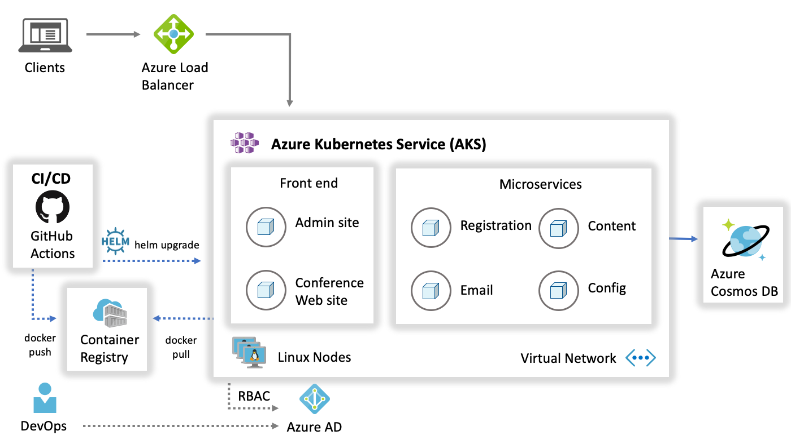

Each tenant will have the following containers:

- **Conference Web site**: The SPA application that will use configuration settings to handle custom styles for the tenant.

- **Admin Web site**: The SPA application that conference owners use to manage conference configuration details, manage attendee registrations, manage campaigns, and communicate with attendees.

- **Registration service**: The API that handles all registration activities creating new conference registrations with the appropriate package selections and associated cost.

- **Email service**: The API that handles email notifications to conference attendees during registration, or when the conference owners choose to engage the attendees through their admin site.

- **Config service**: The API that handles conference configuration settings such as dates, locations, pricing tables, early-bird specials, countdowns, and related.

- **Content service**: The API that handles content for the conference such as speakers, sessions, workshops, and sponsors.

## Requirements

1. Microsoft Azure subscription must be pay-as-you-go or MSDN.

   - Trial subscriptions will _not_ work.

   - To complete this lab, ensure your account has the following roles:

     - The [Owner](https://docs.microsoft.com/azure/role-based-access-control/built-in-roles#owner)
       built-in role for the Azure Subscription you will use.

     - Is a [Member](https://docs.microsoft.com/azure/active-directory/fundamentals/users-default-permissions#member-and-guest-users) user in the Azure AD tenant you will use. (Guest users will not have the necessary permissions.)

   - You must have enough cores available in your subscription to create the build agent and Azure Kubernetes Service cluster in Before the Hands-on Lab. You will need eight cores if following the exact instructions in the lab, or more if you choose additional cluster nodes or larger VM sizes. If you execute the steps required before the lab, you will be able to see if you need to request more cores in your sub.

2. Local machine or a virtual machine configured with:

   - A browser, preferably Chrome for consistency with the lab implementation tests.

3. You will install other tools throughout the exercises.

> **Very important**: You should be typing all the commands as they appear in the guide. Do not try to copy and paste to your command windows or other documents when instructed to enter the information shown in this document, except where explicitly stated in this document. There can be issues with Copy and Paste that result in errors, execution of instructions, or creation of file content.

## Exercise 1: Migrate MongoDB to Cosmos DB using Azure Database Migration Service

**Duration**: 40 minutes

At this point, you have the web and API applications running in Docker instance (VM - Build Agent). The next, step is to migrate the MongoDB database data over to Azure Cosmos DB. This exercise will use the Azure Database Migration Service to migrate the data from the MongoDB database into Azure Cosmos DB.

### Task 1: Enable Microsoft.DataMigration resource provider

In this task, you will enable the use of the Azure Database Migration Service within your Azure subscription by registering the `Microsoft.DataMigration` resource provider.

1. Open the Azure Cloud Shell.

2. Run the following Azure CLI command to register the `Microsoft.DataMigration` resource provider in your Azure subscription:

   ```sh
   az provider register --namespace Microsoft.DataMigration
   ```

### Task 2: Provision Azure Database Migration Service

In this task, you will deploy an instance of the Azure Database Migration Service that will be used to migrate the data from MongoDB to Cosmos DB.

1. From the Azure Portal, select **+ Create a resource**.

2. Search the marketplace for **Azure Database Migration Service** and select it.

3. Select **Create**.

    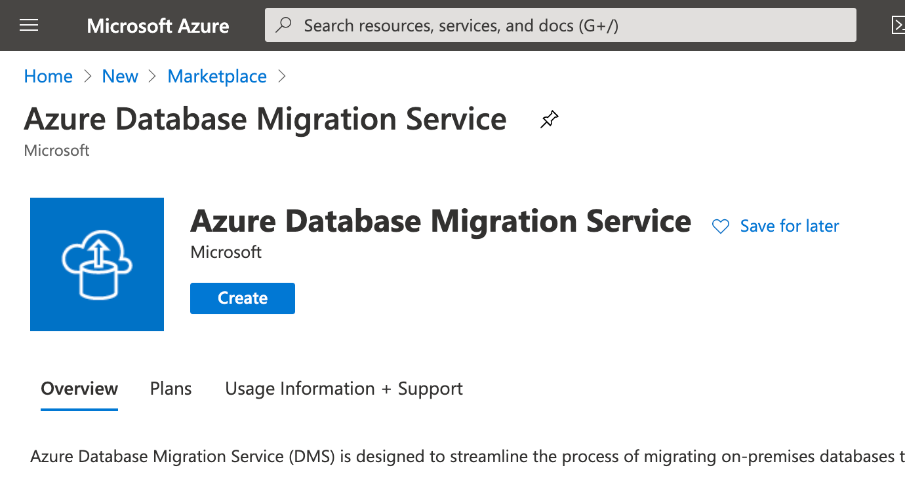

4. On the **Basics** tab of the **Create Migration Service** pane, enter the following values:

    - Resource group: Select the Resource Group created with this lab.
    - Migration service name: Enter a name, such as `fabmedical[SUFFIX]`.
    - Location: Choose the Azure Region used for the Resource Group.

    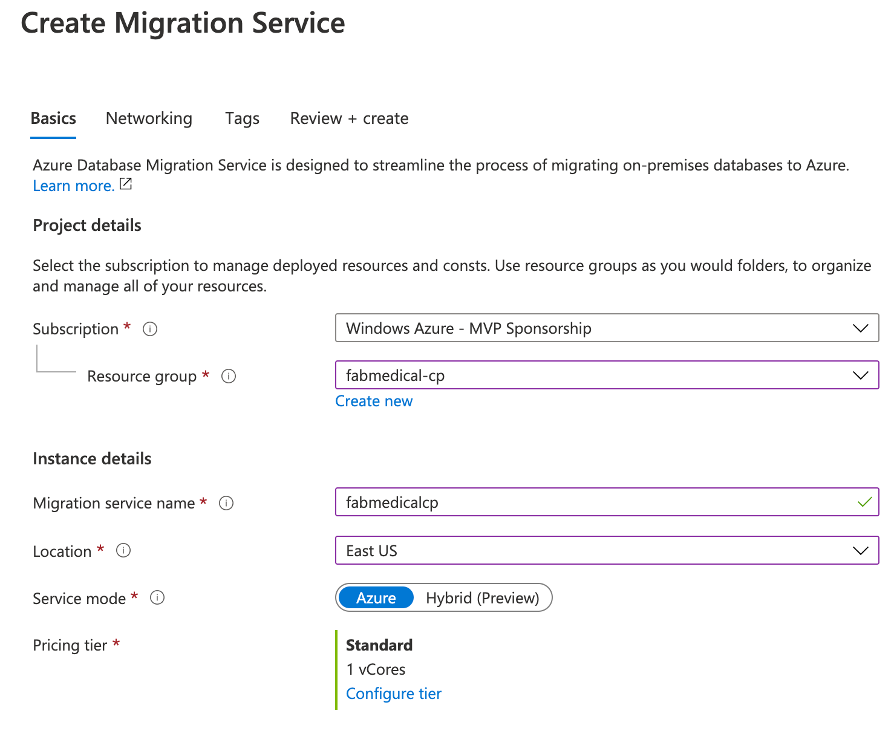

5. Select **Next: Networking >>**.

6. On the **Networking** tab, select the **Virtual Network** within the `fabmedical-[SUFFIX]` resource group.

    

7. Select **Review + create**.

8. Select **Create** to create the Azure Database Migration Service instance.

The service may take 5 - 10 minutes to provision.

### Task 3: Migrate data to Azure Cosmos DB

In this task, you will create a **Migration project** within Azure Database Migration Service, and then migrate the data from MongoDB to Azure Cosmos DB.

1. In the Azure Portal, navigate to your Build Agent VM, and copy the Private IP address **(2)**. Paste the contents into the text editor of your choice (such as Notepad on Windows, macOS users can use TextEdit) for future use.

   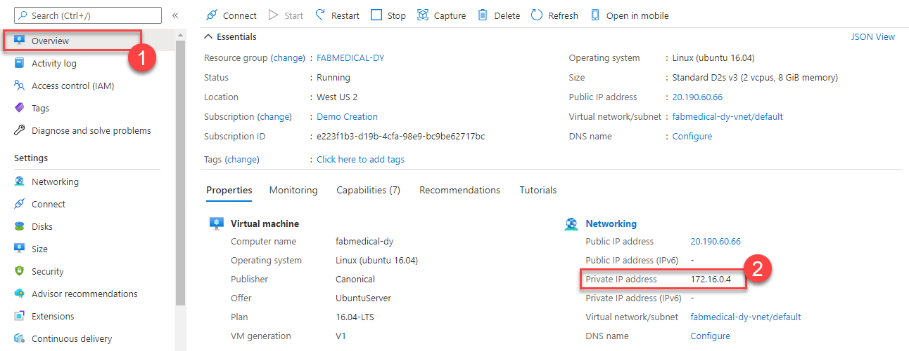

2. In the Azure Portal, navigate to the **Azure Database Migration Service** that was previously provisioned.

3. On the Azure Database Migration Service blade, select **+ New Migration Project** on the **Overview** pane.

4. On the **New migration project** pane, enter the following values, then select **Create and run activity**:

    - Project name: `fabmedical`
    - Source server type: `MongoDB`
    - Target server type: `CosmosDB (MongoDB API)`
    - Choose type of activity: `Offline data migration`

    

    > **Note:** The **Offline data migration** activity type is selected since you will be performing a one-time migration from MongoDB to Cosmos DB. Also, the data in the database won't be updated during the migration. In a production scenario, you will want to choose the migration project activity type that best fits your solution requirements.

5. On the **MongoDB to Azure Database for CosmosDB Offline Migration Wizard** pane, enter the following values for the **Select source** tab:

    - Mode: **Standard mode**
    - Source server name: Enter the Private IP Address of the Build Agent VM used in this lab.
    - Server port: `27017`
    - Require SSL: Unchecked

    > **Note:** Leave the **User Name** and **Password** blank as the MongoDB instance on the Build Agent VM for this lab does not have authentication turned on. The Azure Database Migration Service is connected to the same VNet as the Build Agent VM, so it's able to communicate within the VNet directly to the VM without exposing the MongoDB service to the Internet. In production scenarios, you should always have authentication enabled on MongoDB.

    

6. Select **Next: Select target >>**.

7. On the **Select target** pane, select the following values:

    - Mode: **Select Cosmos DB target**

    - Subscription: Select the Azure subscription you're using for this lab.

    - Select Cosmos DB name: Select the `fabmedical-[SUFFIX]` Cosmos DB instance.

    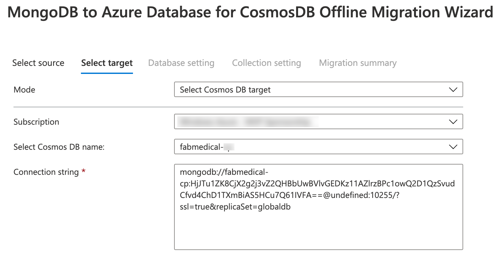

    Notice, the **Connection String** will automatically populate with the Key for your Azure Cosmos DB instance.

8. Modify the **Connection string** by replacing `@undefined:` with `@fabmedical-[SUFFIX].documents.azure.com:` so the DNS name matches the Azure Cosmos DB instance. Be sure to replace the `[SUFFIX]`.

    

9. Select **Next: Database setting >>**.

10. On the **Database setting** tab, select the `contentdb` **Source Database** so this database from MongoDB will be migrated to Azure Cosmos DB.

    

11. Select **Next: Collection setting >>**.

12. On the **Collection setting** tab, expand the **contentdb** database, and ensure both the **sessions** and **speakers** collections are selected for migration. Also, update the **Throughput (RU/s)** to `400` for both collections.

    

13. Select **Next: Migration summary >>**.

14. On the **Migration summary** tab, enter `MigrateData` in the **Activity name** field, then select **Start migration** to initiate the migration of the MongoDB data to Azure Cosmos DB.

    

15. The status for the migration activity will be shown. The migration will only take a few seconds to complete. Select **Refresh** to reload the status to ensure it shows a **Status** of **Complete**.

    

16. To verify the data was migrated, navigate to the **Cosmos DB Account** for the lab within the Azure Portal, then select the **Data Explorer**. You will see the `speakers` and `sessions` collections listed within the `contentdb` database, and you will be able to explore the documents within.

    

## Exercise 2: Deploy the solution to Azure Kubernetes Service

**Duration**: 60 minutes

In this exercise, you will connect to the Azure Kubernetes Service cluster you created before the hands-on lab and deploy the Docker application to the cluster using Kubernetes.

### Task 1: Tunnel into the Azure Kubernetes Service cluster

In this task, you will gather the information you need about your Azure Kubernetes Service cluster to connect to the cluster and execute commands to connect to the Kubernetes management dashboard from cloud shell.

> **Note**: The following tasks should be executed in cloud shell and not the build machine, so disconnect from build machine if still connected.

1. Verify that you are connected to the correct subscription with the following command to show your default subscription:

   ```bash
   az account show
   ```

   - If you are not connected to the correct subscription, list your subscriptions and then set the subscription by its id with the following commands (similar to what you did in cloud shell before the lab):

   ```bash
   az account list
   az account set --subscription {id}
   ```

2. Configure kubectl to connect to the Kubernetes cluster:

   ```bash
   az aks get-credentials -a --name fabmedical-SUFFIX --resource-group fabmedical-SUFFIX
   ```

3. Test that the configuration is correct by running a simple kubectl command to produce a list of nodes:

   ```bash
   kubectl get nodes
   ```

   

### Task 2: Deploy a service using the Azure Portal

In this task, you will deploy the API application to the Azure Kubernetes Service cluster using the Azure Portal.

1. Create a namespace in Kubernetes where we will deploy our resources.

    ```bash
    kubectl create namespace ingress-demo
    ```

2. We first need to define a Service for our API so that the application is accessible within the cluster. In the AKS blade in the Azure Portal select **Services and ingresses** and on the Services tab select **+ Add**.

    

3. In the **Add with YAML** screen, paste following YAML and choose **Add**.

   ```yaml
    apiVersion: v1
    kind: Service
    metadata:
      labels:
        app: api
      name: api
      namespace: ingress-demo
    spec:
      ports:
        - name: api-traffic
          port: 3001
          protocol: TCP
          targetPort: 3001
      selector:
        app: api
      sessionAffinity: None
      type: ClusterIP
   ```

4. Now select **Workloads** under the **Kubernetes resources** section in the left navigation.

    

5. From the Workloads view, with **Deployments** selected (the default) then select **+ Add**.

   

6. In the **Add with YAML** screen that loads paste the following YAML and update the `[LOGINSERVER]` placeholder with the name of the ACR instance.

   ```yaml
    apiVersion: apps/v1
    kind: Deployment
    metadata:
      labels:
        app: api
      name: api
      namespace: ingress-demo
    spec:
      replicas: 1
      selector:
        matchLabels:
          app: api
      strategy:
        rollingUpdate:
        maxSurge: 1
        maxUnavailable: 1
        type: RollingUpdate
      template:
        metadata:
          labels:
            app: api
            name: api
        spec:
          containers:
            - name: api
              image: [LOGINSERVER].azurecr.io/content-api
              imagePullPolicy: Always
              livenessProbe:
                httpGet:
                  path: /
                  port: 3001
                initialDelaySeconds: 30
                periodSeconds: 20
                timeoutSeconds: 10
                failureThreshold: 3
              ports:
                - containerPort: 3001
                  hostPort: 3001
                  protocol: TCP
              resources:
                requests:
                  cpu: 1
                  memory: 128Mi
              securityContext:
                privileged: false
                terminationMessagePath: /dev/termination-log
                terminationMessagePolicy: File
                dnsPolicy: ClusterFirst
                restartPolicy: Always
                schedulerName: default-scheduler
                securityContext: {}
                terminationGracePeriodSeconds: 30
   ```

7. Select **Add** to initiate the deployment. This can take a few minutes after which you will see the deployment listed.

   

8. Select the **api** deployment to open the Deployment, select **Live logs** and then a Pod from the drop-down. After a few moments, the live logs should appear.

   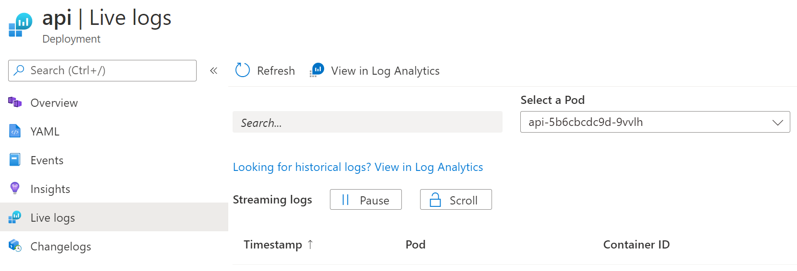

   > **Note:** if the logs don't display it may be the Pod no longer exists. You can use the **View in Log Analytics** to view historical logs regardless of Pod.

9. If you scroll through the log you can see it indicates that the content-api application is once again failing because it cannot find a MongoDB api to communicate with. You will resolve this issue by connecting to Cosmos DB.

   

10. In the Azure Portal navigate to your resource group and find your Cosmos DB. Select the Cosmos DB resource to view details.

   

11. Under **Quick Start** select the **Node.js** tab and copy the **Node.js 3.0 connection string**.

    

12. Modify the copied connection string by adding the database `contentdb` to the URL, along with a replicaSet of `globaldb`. The resulting connection string should look like the below sample. Note that you may need to modify the endpoint URL.

    > **Note**: Username and password redacted for brevity.

    ```text
    mongodb://<USERNAME>:<PASSWORD>@fabmedical-<SUFFIX>.documents.azure.com:10255/contentdb?ssl=true&replicaSet=globaldb
    ```

    > **Note**: This lab has referenced the Cosmos DB API version 3.2. However, if your copied connection string has the endpoint suffix `.mongo.cosmos.azure.com`, feel free to use it, as that will reference the 3.6 API. The lab is compatible with both versions. Here is how the connection string shown above will appear with the 3.6 API:

    ```text
    mongodb://<USERNAME>:<PASSWORD>@fabmedical-<SUFFIX>.mongo.cosmos.azure.com:10255/contentdb?ssl=true&replicaSet=globaldb
    ```


13. You will setup a Kubernetes secret to store the connection string and configure the `content-api` application to access the secret. First, you must base64 encode the secret value. Open your Azure Cloud Shell window and use the following command to encode the connection string and then, copy the output.

    > **Note**: Double quote marks surrounding the connection string are required to successfully produce the required output.

    ```bash
    echo -n "[CONNECTION STRING VALUE]" | base64 -w 0 - | echo $(</dev/stdin)
    ```

    

14. Return to the AKS blade in the Azure Portal and select **Configuration** under the **Kubernetes resources** section. Select **Secrets** and choose **+ Add**.

15. In the **Add with YAML** screen, paste following YAML and replace the placeholder with the encoded connection string from your clipboard and choose **Add**. Note that YAML is position sensitive so you must ensure indentation is correct when typing or pasting.

    ```yaml
    apiVersion: v1
    kind: Secret
    metadata:
      name: cosmosdb
      namespace: ingress-demo
    type: Opaque
    data:
      db: <base64 encoded value>
    ```

    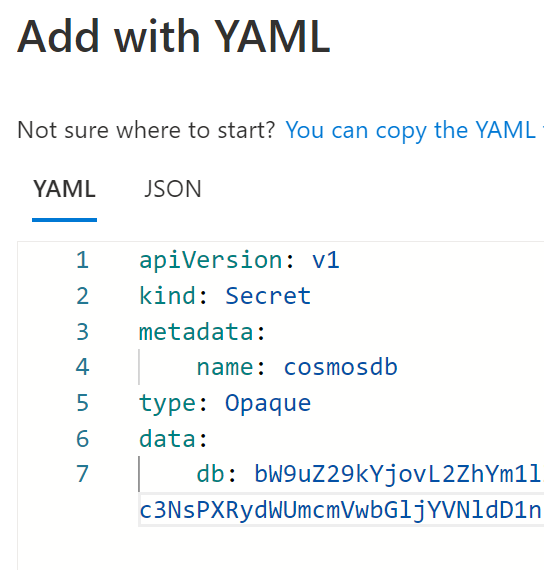

16. Sort the Secrets list by name and you should now see your new secret displayed.

    

17. View the details for the **cosmosdb** secret by selected it in the list.

    

18. Next, download the api deployment configuration using the following command in your Azure Cloud Shell window:

    ```bash
    kubectl get deployment api -n ingress-demo -o=yaml > api.deployment.yml
    ```

19. Edit the downloaded file using cloud shell code editor:

    ```bash
    code api.deployment.yml
    ```

    Add the following environment configuration to the container spec, below the `image` property:

    ```yaml
      env:
      - name: MONGODB_CONNECTION
        valueFrom:
          secretKeyRef:
            name: cosmosdb
            key: db
    ```

    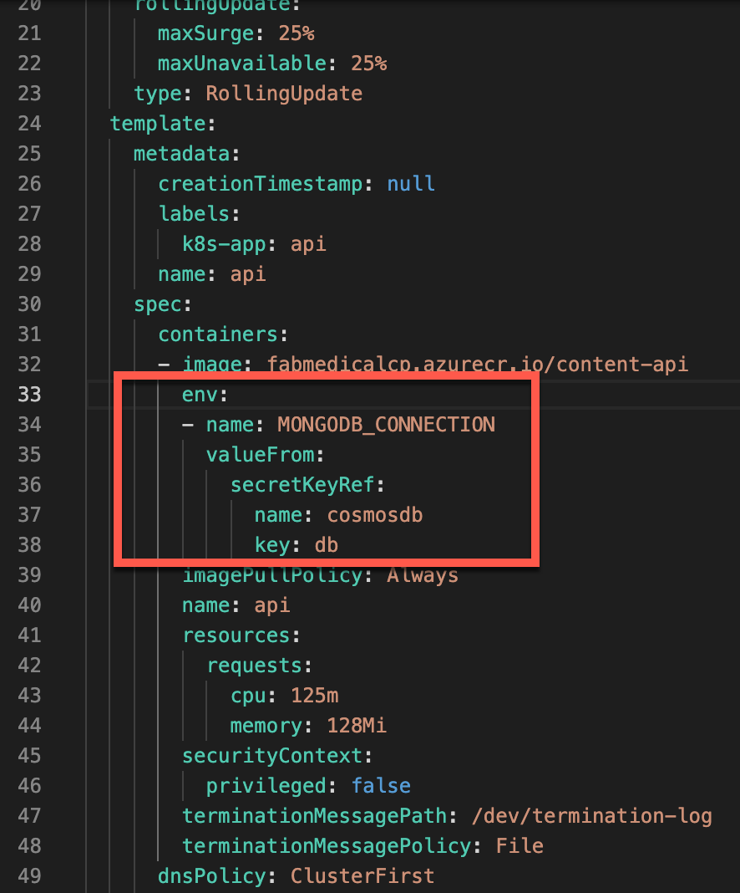

20. Save your changes and close the editor.

    

21. Update the api deployment by using `kubectl` to deploy the API.

    ```bash
    kubectl delete deployment api -n ingress-demo 
    kubectl create -f api.deployment.yml
    ```

22. In the Azure Portal return to Live logs (see Step 5). The last log should show as connected to MongoDB.

    

### Task 3: Deploy a service using kubectl

In this task, deploy the web service using `kubectl`.

1. Open a **new** Azure Cloud Shell console.

2. Create a text file called `web.deployment.yml` using the Azure Cloud Shell
   Editor.

   ```bash
   code web.deployment.yml
   ```

3. Copy and paste the following text into the editor:

   > **Note**: Be sure to copy and paste only the contents of the code block carefully to avoid introducing any special characters.

   ```yaml
   apiVersion: apps/v1
   kind: Deployment
   metadata:
     labels:
         app: web
     name: web
     namespace: ingress-demo
   spec:
     replicas: 1
     selector:
         matchLabels:
           app: web
     strategy:
         rollingUpdate:
           maxSurge: 1
           maxUnavailable: 1
         type: RollingUpdate
     template:
         metadata:
           labels:
               app: web
           name: web
         spec:
           containers:
           - image: [LOGINSERVER].azurecr.io/content-web
             env:
               - name: CONTENT_API_URL
                 value: http://api:3001
             livenessProbe:
               httpGet:
                   path: /
                   port: 3000
               initialDelaySeconds: 30
               periodSeconds: 20
               timeoutSeconds: 10
               failureThreshold: 3
             imagePullPolicy: Always
             name: web
             ports:
               - containerPort: 3000
                 hostPort: 80
                 protocol: TCP
             resources:
               requests:
                   cpu: 1000m
                   memory: 128Mi
             securityContext:
               privileged: false
             terminationMessagePath: /dev/termination-log
             terminationMessagePolicy: File
           dnsPolicy: ClusterFirst
           restartPolicy: Always
           schedulerName: default-scheduler
           securityContext: {}
           terminationGracePeriodSeconds: 30
   ```

4. Update the `[LOGINSERVER]` entry to match the name of your ACR Login Server.

5. Select the **...** button and choose **Save**.

   

6. Select the **...** button again and choose **Close Editor**.

   

7. Create a text file called `web.service.yml` using the Azure Cloud Shell
   Editor.

   ```bash
   code web.service.yml
   ```

8. Copy and paste the following text into the editor:

   > **Note**: Be sure to copy and paste only the contents of the code block carefully to avoid introducing any special characters.

   ```yaml
   apiVersion: v1
   kind: Service
   metadata:
     labels:
       app: web
     name: web
     namespace: ingress-demo
   spec:
     ports:
       - name: web-traffic
         port: 80
         protocol: TCP
         targetPort: 3000
     selector:
       app: web
     sessionAffinity: None
     type: LoadBalancer
   ```

9. Save changes and close the editor.

10. Type the following command to deploy the application described by the YAML files. You will receive a message indicating the items kubectl has created a web deployment and a web service.

    ```bash
    kubectl create --save-config=true -f web.deployment.yml -f web.service.yml
    ```

    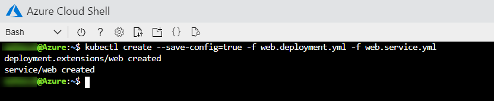

11. Return to the AKS blade in the Azure Portal. From the navigation menu, under **Kubernetes resources**, select the **Services and ingresses** view. You should be able to access the website via an external endpoint.

    

12. In the top navigation, select the `speakers` and `sessions` links.

    

### Task 4: Review Azure Monitor for Containers

In this task, you will access and review the various logs and dashboards made available by Azure Monitor for Containers.

1. From the Azure Portal, select the resource group you created named `fabmedical-SUFFIX`, and then select your `Kubernetes Service` Azure resource.

   

2. From the Monitoring blade, select **Insights**.

   

3. Review the various available dashboards and a deeper look at the various metrics and logs available on the Cluster, Nodes, Controllers, and deployed Containers.

   

4. To review the Containers dashboards and see more detailed information about each container, select the **Containers** tab.

   

5. Now filter by container name and search for the **web** containers, you will see all the containers created in the Kubernetes cluster with the pod names. 

   

6. By default, the CPU Usage metric will be selected displaying all CPU information for the selected container, to switch to another metric open the metric dropdown list and select a different metric.

   

7. Upon selecting any pod, all the information related to the selected metric will be displayed on the right panel, and that would be the case when selecting any other metric, the details will be displayed on the right panel for the selected pod.

   

8. To display the logs for any container simply select it and view the right panel and you will find "View container logs" option which will list all logs for this specific container.

   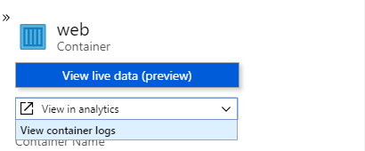

   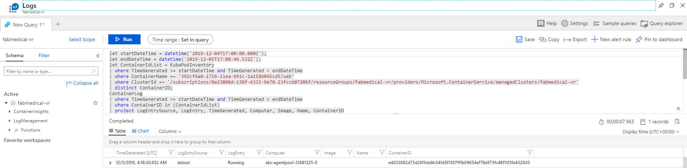

9. For each log entry you can display more information by expanding the log entry to view the below details.

   

## Exercise 3: Scale the application and test HA

**Duration**: 40 minutes

At this point, you have deployed a single instance of the web and API service containers. In this exercise, you will increase the number of container instances for the web service and scale the front-end on the existing cluster.

### Task 1: Increase service instances from the Azure Portal

In this task, you will increase the number of instances for the API deployment in the AKS Azure Portal blade. While it is deploying, you will observe the changing status.

1. In the AKS blade in the Azure Portal select **Workloads** and then select the **API** deployment.

2. Select **YAML** in the window that loads and scroll down until you find **replicas**. Change the number of replicas to **2**, and then select **Review + save**. When prompted, check **Confirm manifest change** and select **Save**.

   

   > **Note**: If the deployment completes quickly, you may not see the deployment Waiting states in the portal, as described in the following steps.

3. From the Replica Set view for the API, you will see it is now deploying and that there is one healthy instance and one pending instance.

   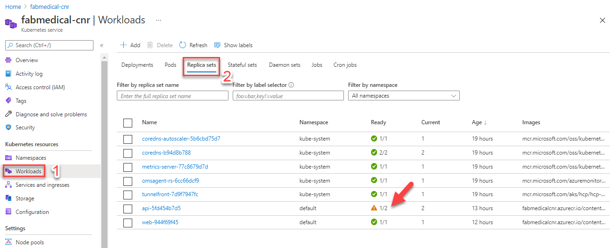

4. From the navigation menu, select **Workloads**. Note that the api Deployment has an alert and shows a pod count 1 of 2 instances (shown as `1/2`).

   

   > **Note**: If you receive an error about insufficient CPU that is OK. We will see how to deal with this in the next Task (Hint: you can use the **Insights** option in the AKS Azure Portal to review the **Node** status and view the Kubernetes event logs).

   At this point, here is a health overview of the environment:

   - One Deployment and one Replica Set are each healthy for the web service.

   - The api Deployment and Replica Set are in a warning state.

   - Two pods are healthy in the 'default' namespace.

5. Open the Contoso Neuro Conference web application. The application should still work without errors as you navigate to Speakers and Sessions pages.

   - Navigate to the `/stats` page. You will see information about the hosting environment including:

     - **webTaskId:** The task identifier for the web service instance.

     - **taskId:** The task identifier for the API service instance.

     - **hostName:** The hostname identifier for the API service instance.

     - **pid:** The process id for the API service instance.

     - **mem:** Some memory indicators returned from the API service instance.

     - **counters:** Counters for the service itself, as returned by the API service instance.

     - **uptime:** The up time for the API service.

### Task 2: Resolve failed provisioning of replicas

In this task, you will resolve the failed API replicas. These failures occur due to the clusters' inability to meet the requested resources.

1. In the AKS blade in the Azure Portal select **Workloads** and then select the **API** deployment. Select the **YAML** navigation item.

2. In the **YAML** screen scroll down and change the following items:

   - Modify **ports** and remove the **hostPort**. Two Pods cannot map to the same host port.

      ```yaml
      ports:
        - containerPort: 3001
          protocol: TCP
      ```

   - Modify the **cpu** and set it to **100m**. CPU is divided between all Pods on a Node.

      ```yaml
      resources:
        requests:
          cpu: 100m
          memory: 128Mi
      ```

   Select **Review + save** and, when prompted, confirm the changes and select **Save**.

   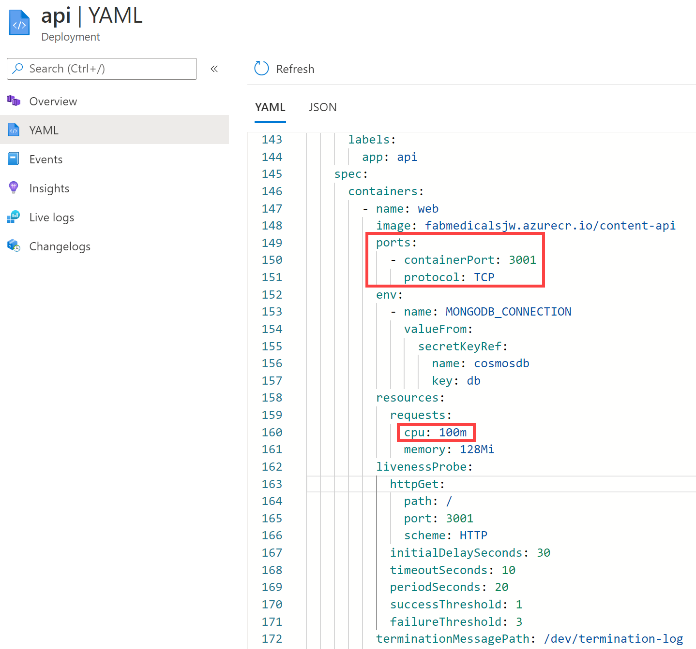

3. Return to the **Workloads** main view on the AKS Azure Portal and you will now see that the Deployment is healthy with two Pods operating.

   

### Task 3: Restart containers and test HA

In this task, you will restart containers and validate that the restart does not impact the running service.

1. Open the sample web application and navigate to the "Stats" page as shown.

   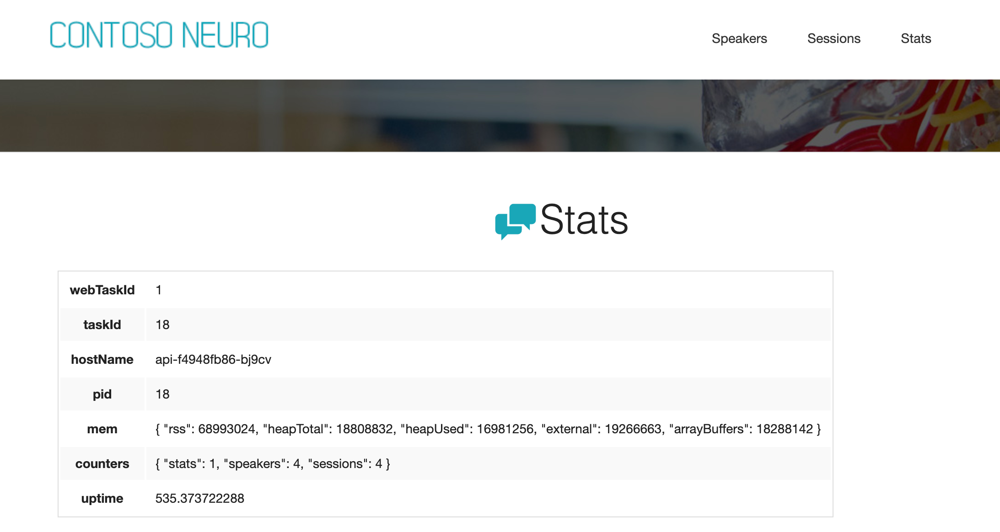

2. In the AKS blade in the Azure Portal open the api Deployment and increase the required replica count to `4`. Use the same process as Exercise 4, Task 1.

   

3. After a few moments you will find that the API deployment is now running 4 replicas successfully.

4. Return to the browser tab with the web application stats page loaded. Refresh the page over and over. You will not see any errors, but you will see the api host name change between the four api pod instances periodically. The task id and pid might also change between the four api pod instances.

   

5. After refreshing enough times to see that the `hostName` value is changing, and the service remains healthy, you can open the **Replica Sets** view for the API in the Azure Portal.

6. On this view you can see the hostName value shown in the web application stats page matches the pod names for the pods that are running.

   

7. Select two of the Pods at random and choose **Delete**. Select **Confirm delete**, and press **Delete** again.

   

8. Kubernetes will launch new Pods to meet the required replica count. Depending on your view you may see the old instances Terminating and new instances being Created.

   

9. Return to the API Deployment and scale it back to `1` replica. See Step 2 above for how to do this if you are unsure.

10. Return to the sample web site's stats page in the browser and refresh while Kubernetes is scaling down the number of Pods. You will notice that only one API host name shows up, even though you may still see several running pods in the API replica set view. Even though several pods are running, Kubernetes will no longer send traffic to the pods it has selected to terminate. In a few moments, only one pod will show in the API Replica Set view.

    

### Task 4: Configure Cosmos DB Autoscale

In this task, you will setup Autoscale on Azure Cosmos DB.

1. In the Azure Portal, navigate to the `fabmedical-[SUFFIX]` **Azure Cosmos DB Account**.

2. Select **Data Explorer**.

3. Within **Data Explorer**, expand the `contentdb` database, then expand the `sessions` collection.

4. Under the `sessions` collection, select **Scale & Settings**.

5. On the **Scale & Settings**, select **Autoscale** for the **Throughput** setting under **Scale**.

    

6. Select **Save**.

7. Perform the same task to enable **Autoscale** Throughput on the `speakers` collection.

### Task 5: Test Cosmos DB Autoscale

In this task, you will run a performance test script that will test the Autoscale feature of Azure Cosmos DB so you can see that it will now scale greater than 400 RU/s.

1. In the Azure Portal, navigate to the `fabmedical-[SUFFIX]` **Cosmos DB account**.

2. Select **Connection String** under **Settings**.

3. On the **Connection String** pane, copy the **HOST**, **USERNAME**, and **PRIMARY PASSWORD** values. Save these for use later.

    

    >**Note**: In your Cosmos DB account, you may see that the host endpoint uses `.mongo.cosmos.azure.com`, which is for version 3.6 of Mongo DB. The endpoint shown here is `.documents.azure.com`, which is for version 3.2 of Mongo DB. You can use either endpoint for the purposes of this Task. If you are curious about the new features added to version 3.6 (that do not affect the application in this lab), consult [this](https://devblogs.microsoft.com/cosmosdb/upgrade-your-server-version-from-3-2-to-3-6-for-azure-cosmos-db-api-for-mongodb/) post.

4. Open the Azure Cloud Shell, and **SSH** to the **Build agent VM**.

5. On the **Build agent VM**, navigate to the `~/Fabmedical` directory.

    ```bash
    cd ~/Fabmedical
    ```

6. Run the following command to open the `perftest.sh` script for editing in Vim.

    ```bash
    vi perftest.sh
    ```

7. There are several variables declared at the top of the `perftest.sh` script. Modify the **host**, **username**, and **password** variables by setting their values to the corresponding Cosmos DB Connection String values that were copied previously.

    

8. Save the file and exit Vim.

9. Run the following command to execute the `perftest.sh` script to run a small load test against Cosmos DB. This script will consume RU's in Cosmos DB by inserting many documents into the Sessions container.

    ```bash
    bash ./perftest.sh
    ```

    > **Note:** The script will take a minute to complete executing.

10. Once the script has completed, navigate back to the **Cosmos DB account** in the Azure portal.

11. Scroll down on the **Overview** pane of the **Cosmos DB account** blade, and locate the **Request Charge** graph.

    > **Note:** It may take 2 - 5 minutes for the activity on the Cosmos DB collection to appear in the activity log. Wait a couple minutes and then refresh the pane if the recent Request charge doesn't show up right now.

12. Notice that the **Request charge** now shows there was activity on the **Cosmos DB account** that exceeded the 400 RU/s limit that was previously set before Autoscale was turned on.

    

## Exercise 4: Working with services and routing application traffic

**Duration**: 120 minutes

In the previous exercise, we introduced a restriction to the scale properties of the service. In this exercise, you will configure the api deployments to create pods that use dynamic port mappings to eliminate the port resource constraint during scale activities.

Kubernetes services can discover the ports assigned to each pod, allowing you to run multiple instances of the pod on the same agent node --- something that is not possible when you configure a specific static port (such as 3001 for the API service).

### Task 1: Update an external service to support dynamic discovery with a load balancer

In this task, you will update the web service so that it supports dynamic discovery through an Azure load balancer.

1. From AKS **Kubernetes resources** menu, select **Deployments** under **Workloads**. From the list select the **web** deployment.

2. Select **YAML**, then select the **JSON** tab.

3. First locate the replicas node and update the required count to `4`.

4. Next, scroll to the web containers spec as shown in the screenshot. Remove the hostPort entry for the web container's port mapping.

   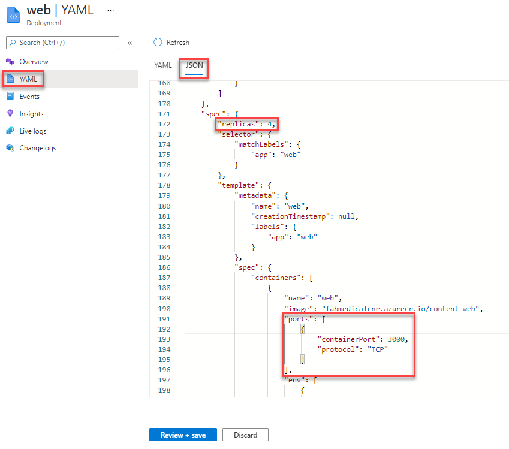

5. Select **Review + save** and then confirm the change and **Save**.

6. Check the status of the scale out by refreshing the web deployment's view. From the navigation menu, select **Pods** from under Workloads. Select the **web** pods. From this view, you should see an error like that shown in the following screenshot.

   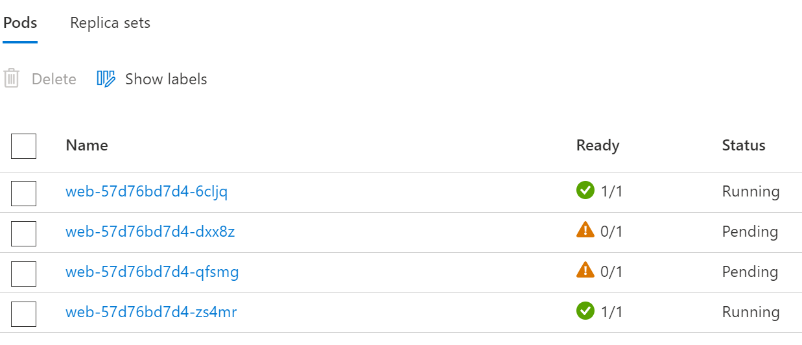

Like the API deployment, the web deployment used a fixed _hostPort_, and your ability to scale was limited by the number of available agent nodes. However, after resolving this issue for the web service by removing the _hostPort_ setting, the web deployment is still unable to scale past two pods due to CPU constraints. The deployment is requesting more CPU than the web application needs, so you will fix this constraint in the next task.

### Task 2: Adjust CPU constraints to improve scale

In this task, you will modify the CPU requirements for the web service so that it can scale out to more instances.

1. Re-open the JSON view for the web deployment and then find the **cpu** resource requirements for the web container. Change this value to `125m`.

   

2. Select **Review + save**, confirm the change and then select **Save** to update the deployment.

3. From the navigation menu, select **Replica Sets** under **Workloads**. From the view's Replica Sets list select the web replica set.

4. When the deployment update completes, four web pods should be shown in running state.

   

### Task 3: Perform a rolling update

In this task, you will edit the web application source code to add Application Insights and update the Docker image used by the deployment. Then you will perform a rolling update to demonstrate how to deploy a code change.

1. Execute this command in Azure Cloud Shell to retrieve the instrumentation key for the `content-web` Application Insights resource:

   ```bash
   az resource show -g fabmedical-[SUFFIX] -n content-web --resource-type "Microsoft.Insights/components" --query properties.InstrumentationKey -o tsv
   ```

   Copy this value. You will use it later.

   > **Note**: if you have a blank result check that the command you issued refers to the right resource.

2. On your lab VM update your fabmedical repository files by pulling the latest changes from the git repository:

   ```bash
   cd ~/fabmedical/content-web
   git pull
   ```

3. Install support for Application Insights.

   ```bash
   npm install applicationinsights --save
   ```

4. Edit the `app.js` file using Vim or Visual Studio Code remote and add the following lines immediately after `express` is instantiated on line 6:

   ```javascript
   const appInsights = require("applicationinsights");
   appInsights.setup("[YOUR APPINSIGHTS KEY]");
   appInsights.start();
   ```

   

5. Save changes and close the editor.

6. Add the following task to the `content-web.yml` workflow file in the `.github/workflows` folder. Be sure to keep indention of the task within the file consistent with the rest of the `content-web.yml` file.

  ```
        - name: Deploy to AKS
          uses: azure/k8s-deploy@v1
          with:
            manifests: |
              api.deployment.yml
              web.deployment.yml
              web.service.yml
            images: |
              ${{ env.containerRegistry }}/${{ env.imageRepository }}:${{ env.tag }}
            imagepullsecrets: |
              ingress-demo-secret
            namespace: ingress-demo
  ```

> **Note**: Ensure the following files from [Exercise 2](#exercise-2-deploy-the-solution-to-azure-kubernetes-service), Tasks [2](#task-2-deploy-a-service-using-the-azure-portal) and [3](#task-3-deploy-a-service-using-kubectl) are present in the git repository root.
   ```
   api.deployment.yml
   web.deployment.yml
   web.service.yml
   ```

7. Push these changes to your repository so that GitHub Actions CI will build and deploy a new Container image.

   ```bash
   git add .
   git commit -m "Added Application Insights"
   git push
   ```

8. Visit the `content-web` Action for your GitHub Fabmedical repository and see the new Image being deployed into your Kubernetes cluster.

9. While this update runs, return the Azure Portal in the browser.

10. From the navigation menu, select **Replica Sets** under **Workloads**. From this view, you will see a new replica set for the web, which may still be in the process of deploying (as shown below) or already fully deployed.

    

11. While the deployment is in progress, you can navigate to the web application and visit the stats page at `/stats`. Refresh the page as the rolling update executes. Observe that the service is running normally, and tasks continue to be load balanced.

    

### Task 4: Configure Kubernetes Ingress

In this task you will setup a Kubernetes Ingress using an [nginx proxy server](https://nginx.org/en/) to take advantage of path-based routing and TLS termination.

1. Within the Azure Cloud Shell, run the following command to add the nginx stable Helm repository:

    ```bash
    helm repo add ingress-nginx https://kubernetes.github.io/ingress-nginx
    ```

2. Update your helm package list.

   ```bash
   helm repo update
   ```

   > **Note**: If you get a "no repositories found." error, then run the following command. This will add back the official Helm "stable" repository.
   >
   > ```bash
   > helm repo add stable https://charts.helm.sh/stable 
   > ```

4. Install the Ingress Controller resource to handle ingress requests as they come in. The Ingress Controller will receive a public IP of its own on the Azure Load Balancer and be able to handle requests for multiple services over port 80 and 443.

   ```bash
   helm install nginx-ingress ingress-nginx/ingress-nginx \
    --namespace ingress-demo \
    --set controller.replicaCount=2 \
    --set controller.nodeSelector."beta\.kubernetes\.io/os"=linux \
    --set defaultBackend.nodeSelector."beta\.kubernetes\.io/os"=linux \
    --set controller.admissionWebhooks.patch.nodeSelector."beta\.kubernetes\.io/os"=linux
   ```

5. In the Azure Portal under **Services and ingresses** copy the IP Address for the **External IP** for the `nginx-ingress-RANDOM-nginx-ingress` service.

   

    > **Note**: It could take a few minutes to refresh, alternately, you can find the IP using the following command in Azure Cloud Shell.
    >
    > ```bash
    > kubectl get svc --namespace ingress-demo
    > ```
    >
   

6. Open the [Azure Portal Resource Groups blade](https://portal.azure.com/?feature.customPortal=false#blade/HubsExtension/BrowseResourceGroups) and locate the Resource Group that was automatically created to host the Node Pools for AKS. It will have the naming format of `MC_fabmedical-[SUFFIX]_fabmedical-[SUFFIX]_[REGION]`.

7. Within the Azure Cloud Shell, create a script to update the public DNS name for the ingress external IP.

   ```bash
   code update-ip.sh
   ```

   Paste the following as the contents. Be sure to replace the following placeholders in the script:

   - `[INGRESS PUBLIC IP]`: Replace this with the IP Address copied from step 5.
   - `[AKS NODEPOOL RESOURCE GROUP]`: Replace with the name of the Resource Group copied from step 6.
   - `[SUFFIX]`: Replace this with the same SUFFIX value used previously for this lab.

   ```bash
   #!/bin/bash

   # Public IP address
   IP="[INGRESS PUBLIC IP]"

   # Resource Group that contains AKS Node Pool
   KUBERNETES_NODE_RG="[AKS NODEPOOL RESOURCE GROUP]"

   # Name to associate with public IP address
   DNSNAME="fabmedical-[SUFFIX]-ingress"

   # Get the resource-id of the public ip
   PUBLICIPID=$(az network public-ip list --resource-group $KUBERNETES_NODE_RG --query "[?ipAddress!=null]|[?contains(ipAddress, '$IP')].[id]" --output tsv)

   # Update public ip address with dns name
   az network public-ip update --ids $PUBLICIPID --dns-name $DNSNAME
   ```

   

8. Save changes and close the editor.

9. Run the update script.

   ```bash
   bash ./update-ip.sh
   ```

10. Verify the IP update by visiting the URL in your browser.

    > **Note**: It is normal to receive a 404 message at this time.

    ```text
    http://fabmedical-[SUFFIX]-ingress.[AZURE-REGION].cloudapp.azure.com/
    ```

    

11. Use helm to install `cert-manager`, a tool that can provision SSL certificates automatically from letsencrypt.org.

    ```bash
    kubectl create namespace cert-manager

    kubectl label namespace cert-manager cert-manager.io/disable-validation=true

    kubectl apply --validate=false -f https://github.com/jetstack/cert-manager/releases/download/v1.0.1/cert-manager.yaml
    ```

12. Cert manager will need a custom ClusterIssuer resource to handle requesting SSL certificates.

    ```bash
    code clusterissuer.yml
    ```

    The following resource configuration should work as is:

    ```yaml
    apiVersion: cert-manager.io/v1
    kind: ClusterIssuer
    metadata:
      name: letsencrypt-prod
    spec:
      acme:
        # The ACME server URL
        server: https://acme-v02.api.letsencrypt.org/directory
        # Email address used for ACME registration
        email: user@fabmedical.com
        # Name of a secret used to store the ACME account private key
        privateKeySecretRef:
          name: letsencrypt-prod
        # Enable HTTP01 validations
        solvers:
        - http01:
            ingress:
              class: nginx
    ```

13. Save changes and close the editor.

14. Create the issuer using `kubectl`.

    ```bash
    kubectl create --save-config=true -f clusterissuer.yml
    ```

15. Now you can create a certificate object.

    > **Note**:
    >
    > Cert-manager might have already created a certificate object for you using ingress-shim.
    >
    > To verify that the certificate was created successfully, use the `kubectl describe certificate tls-secret` command.
    >
    > If a certificate is already available, skip to step 16.

    ```bash
    code certificate.yml
    ```

    Use the following as the contents and update the `[SUFFIX]` and `[AZURE-REGION]` to match your ingress DNS name

    ```yaml
    apiVersion: cert-manager.io/v1
    kind: Certificate
    metadata:
      name: tls-secret
    spec:
      secretName: tls-secret
      dnsNames:
        - fabmedical-[SUFFIX]-ingress.[AZURE-REGION].cloudapp.azure.com
      issuerRef:
        name: letsencrypt-prod
        kind: ClusterIssuer
    ```

16. Save changes and close the editor.

17. Create the certificate using `kubectl`.

    ```bash
    kubectl create --save-config=true -f certificate.yml
    ```

    > **Note**: To check the status of the certificate issuance, use the `kubectl describe certificate tls-secret` command and look for an _Events_ output similar to the following:
    >
    > ```text
    > Type    Reason         Age   From          Message
    > ----    ------         ----  ----          -------
    > Normal  Generated           38s   cert-manager  Generated new private key
    > Normal  GenerateSelfSigned  38s   cert-manager  Generated temporary self signed certificate
    > Normal  OrderCreated        38s   cert-manager  Created Order resource "tls-secret-3254248695"
    > Normal  OrderComplete       12s   cert-manager  Order "tls-secret-3254248695" completed successfully
    > Normal  CertIssued          12s   cert-manager  Certificate issued successfully
    > ```

    It can take between 5 and 30 minutes before the tls-secret becomes available. This is due to the delay involved with provisioning a TLS cert from letsencrypt.

18. Now you can create an ingress resource for the content applications.

    ```bash
    code content.ingress.yml
    ```

    Use the following as the contents and update the `[SUFFIX]` and `[AZURE-REGION]` to match your ingress DNS name:

    ```yaml
    apiVersion: networking.k8s.io/v1beta1
    kind: Ingress
    metadata:
      name: content-ingress
      namespace: ingress-demo
      annotations:
        kubernetes.io/ingress.class: nginx
        nginx.ingress.kubernetes.io/rewrite-target: /$1
        nginx.ingress.kubernetes.io/use-regex: "true"
        nginx.ingress.kubernetes.io/ssl-redirect: "false"
        cert-manager.io/cluster-issuer: letsencrypt-prod
    spec:
      tls:
      - hosts:
          - fabmedical-[SUFFIX]-ingress.[AZURE-REGION].cloudapp.azure.com
        secretName: tls-secret
      rules:
      - host: fabmedical-[SUFFIX]-ingress.[AZURE-REGION].cloudapp.azure.com
        http:
          paths:
          - path: /(.*)
            backend:
              serviceName: web
              servicePort: 80
          - path: /content-api/(.*)
            backend:
              serviceName: api
              servicePort: 3001
    ```

19. Save changes and close the editor.

20. Create the ingress using `kubectl`.

    ```bash
    kubectl create --save-config=true -f content.ingress.yml
    ```

21. Refresh the ingress endpoint in your browser. You should be able to visit the speakers and sessions pages and see all the content.

22. Visit the API directly, by navigating to `/content-api/sessions` at the ingress endpoint.

    

23. Test TLS termination by visiting both services again using `https`.

    > **Note**: It can take between 5 and 30 minutes before the SSL site becomes available. This is due to the delay involved with provisioning a TLS cert from letsencrypt.

## After the hands-on lab

**Duration**: 10 minutes

In this exercise, you will de-provision any Azure resources created in support of this lab.

1. Delete the Resource Groups in which you placed all your Azure resources.

   - From the Portal, navigate to the blade of your **Resource Group** and then select **Delete** in the command bar at the top.

   - Confirm the deletion by re-typing the resource group name and selecting Delete.

You should follow all steps provided _after_ attending the Hands-on lab.
